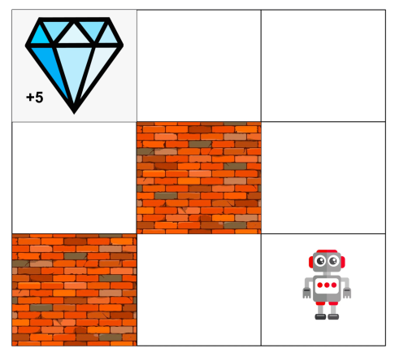
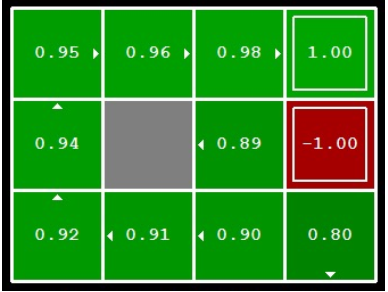
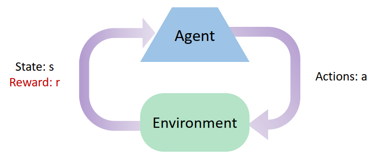

2024春季学期选了xhz老师的限选课**深度强化学习**，恰巧也在研究这方面的内容，于是打算写个笔记。

# From MDP to RL (1)

## MDP Basics

### Definition of MDP

Markov Decision Process (MDP) 是一个决策过程数学模型，直观地来说：一个智能体 (agent) 处在一个环境中，环境处于不同的状态 (state)；每一步，agent 可以得知环境的部分或全部 state 信息，这部分信息称为 agent 的观测 (observation)；通过 observation，agent 每一步会作出决策，给出一个动作 (action)；这个动作会影响环境，环境有概率转移到另一个 state；同时，环境根据潜在的奖励函数 (rewards) 来给 agent 提供奖励。Formally:

> **Definition:**
>
> An MDP is a 4-tuple $(S, A, T, R)$:
>
> - $S$ is a set of states called the *state space*.
> - $A$ is a set of actions called the *action space*.
> - $T(s, a, s^{\prime})=Pr(s_{t+1}=s^{\prime}|s_t=s, a_t=a)$ is the probability that action $a$ at $s$ leads to $s^{\prime}$, called the *transition fuction* (also *model* or *dynamics*).
> - $R(s, a, s^{\prime})$ is the immediate *reward* received after transitioning from state $s$ to state $s^{\prime}$, due to action $a$.

当然这只是最简单的定义，还可以根据情况的不同引入额外的东西。比如系统初始状态的分布函数 (*initial state distribution*)，一个一旦到达就直接停止的结束状态 (*terminal state*)。再比如某些情况下，环境可能是 partially observable 的，agent 无法观测到环境的整个 state (比如打扑克的时候，你无法看到对方手上的牌，这是 partially observable 的，但是下围棋的时候，你可以看到棋盘上所有的东西，这是 fully observable 的)，此时需要在定义中引入 a set of observations $O$，此时的 MDP 称为 Partially Observable MDP (POMDP)。

定义中 Markov 的意思是：给定当前状态之后，未来与过去就无关了，即 $Pr(s_{t+1}|s_t, a_t, s_{t-1}, a_{t-1}, ..., s_0)=Pr(s_{t+1}|s_t, a_t)$。可以认为过去的信息都被浓缩到当前的 state 中了。

### An Example

用一个简单的例子来加深理解:

比如一个 agent 位于这样一个 grid world 中
- 每一时刻的 state 就是 agent 的位置。
- action 是上下左右。
- $T$ 我们定义为，有 80% 的可能，agent 的 transition 与其 action 一致；有 10% 的可能，无论什么 action，agent 都往左；有 10% 的可能，无论什么 action，agent 都往右。
- 只有在 agent 吃到钻石的时候才会有 reward。

### Policy

以上我们主要关注环境，接下来我们看 agent，我们将 agent 从 state/observation 得到 action 的决策称为 policy:

> **Definition:**
>
> Policy $\pi$ 是一个条件概率密度函数 $\pi(a|s)$，表示 agent 在 state $s$ 时采取 action $a$ 的概率。

### Utility

RL 的目标是学出一个好的 policy，那么这个 “好的” 该如何进行评价。直观来看，我们可以将 agent 放在某个 initial state，让其根据自己的 policy 进行运动固定的步数，或是等到最后结束。那么问题就到了，agent 跑出的这个序列 $(s_0, a_0, r_0, s_1, a_1, r_1, ..., s_t, a_t, r_t)$ (称为 trajectory) 该如何评价。我们引入 Reward Hypothesis, 即MDP中所有的目标都应被 reward 定义，而不牵扯到其他的量。那么可以将 trajectory 中的 rewards 单独抽出来 $(r_0, r_1, r_2, ..., r_t)$。我们希望有一个函数 (Utility) 能够将这个 rewards 序列映射成一个标量，这样有助于比较不同 trajectories 的优劣。

一种方法是直接加起来，即 additive utilities: $U([r_0, r_1, r_2, ...]) = r_0+r_1+r_2 + ...$

考虑到现实生活中，当下的 reward 往往比之后的 reward 更具有价值 (当下给你一块钱往往优于两天后给你一块钱)，一个更常用的 utility 是 discounted utilities: $U([r_0, r_1, r_2, ...]) = r_0+\gamma r_1+\gamma^2 r_2 + ...$。其中 $\gamma$ 称为 discounted factor。

### Optimal Quantities

直观上定义 optimal quantities:

- Optimal policy: $\pi^*(s)$ = optimal action from state $s$.
- Optimal value/utility of a state $s$: $V^*(s)$ = expected utility starting from $s$ and acting optimally.
- Optimal Q value: $Q^*(s,a)$ = expected utility taking action $a$ from state $s$ and acting optimally.

Formally 可以递归地定义这些量：

$$\pi^{\*}(s)=\argmax_a Q^{\*}(s,a)$$
$$V^{*}(s)=\max_a Q^{\*}(s,a)$$
$$Q^{\*}(s,a)=\sum_{s^{\prime}}T(s,a,s^{\prime})[R(s,a,s^{\prime})+\gamma V^{\*}(s^{\prime})]$$

从以上两个式子我们可以消去 $Q^{\*}$ 得到 $V^{\*}$ 满足的等式：

$$V^{*}(s)=\max_a \sum_{s^{\prime}}T(s,a,s^{\prime})[R(s,a,s^{\prime})+\gamma V^{\*}(s^{\prime})]$$

称为 Bellman Equation。

## Value Iteration

RL 的最终目标是得到 $\pi^{\*}$，我们可以利用 $V^{\*}$ 来得到 $\pi^{\*}$。一种可行的用来得到 $V^{\*}$ 的方法称为 Value Iteration，其利用了 Bellman Equation。

假设 MDP 在 $k$ 步后结束，定义 $s$ 的 optimal value 为 $V^{\*}_k(s)$，那么有：

$$V_0^{\*}(s)=0$$
$$V_{k+1}^{\*}(s)=\max_a \sum_{s^{\prime}}T(s,a,s^{\prime})[R(s,a,s^{\prime})+\gamma V_k^{\*}(s^{\prime})]$$

迭代计算直至收敛，即可得到 $V_{\infty}^{\*}=V^{\*}$。

VI 有两个问题：
- VI 每一步的时间复杂度为 $O(S^2A)$，因此仅仅适用于 discrete case，并且要求 $S$ 和 $A$ 均比较小，无法适用于连续空间。
- Policy 往往会比 Value 收敛得更早，如果能够提前发现 policy 已经收敛会更好。

## Policy Iteration

### Policy Evaluation

上面介绍的 $V^{\*}$ 是 optimal policy 的 value function，我们也可以给定一个 policy $\pi$，计算其对应的 value function $V^{\pi}$，这个计算过程称为 Policy Evaluation。

$$V^{\pi}(s) = \text{expected total discounted rewards starting in } s \text{ and following } \pi$$

计算过程类似于 Value Iteration，也是从相应的 Bellman Equation 入手进行迭代计算：

$$V^{\pi}(s)=\sum_{s^{\prime}}T(s,\pi(s),s^{\prime})[R(s,\pi(s),s^{\prime})+\gamma V^{\pi}(s^{\prime})]$$

Policy Evaluation 一步花费时间 $O(S^2)$。

### Policy Improvement

假设我们知道一个 MDP 的 value function, 如何得到在这个 value function 下的 optimal policy。显然可以在某个状态 $s$ 遍历所有的 action $a$，看哪个 $a$ 的收益最大，即：

$$\pi(s)=\argmax_a \sum_{s^{\prime}}T(s,a,s^{\prime})[R(s,a,s^{\prime})+\gamma V(s^{\prime})]$$

这个过程就是 policy improvement。

### Policy Iteration

结合 Policy Evaluation 和 Policy Improvement，我们可以用另一种方法（不同于 Value Iteration）来得到 $\pi^*$。

循环以下两步直至 policy 收敛：
- Step 1: Policy Evaluation。对当前的 policy 进行 policy evaluation。
- Step 2: Policy Improvement。对 Step 1 中得到的 value function 进行 policy improvement，得到新的 policy。

这就是 Policy Iteration。PI 也可以得到 optimal $\pi^*$，并且在一些情况下比 VI 收敛得更快。

## MDP to Reinforcement Learning

不管是 VI 还是 PI，都要求我们知道 MDP 的 $T(s,a,s^{\prime})$ 和 $R(s,a,s^{\prime})$。但是在现实中的大部分情况，我们并不能准确地知道 $T(s,a,s^{\prime})$ 和 $R(s,a,s^{\prime})$，尤其是 $T$，因此需要引入 RL。

RL 的主要思想是：
- 环境会为 agent 的 action 提供 reward 进行反馈。
- Agent 的所有 utility 都被 reward 定义。
- Agent 的目标是 maximize expected rewards。
- 学习只能基于 agent 获取到的 observations, actions, rewards 等信息（不知道真实的 $T(s,a,s^{\prime})$ 和 $R(s,a,s^{\prime})$）。