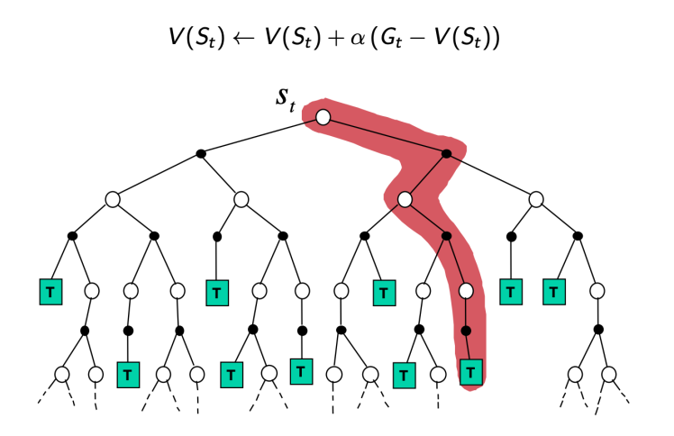
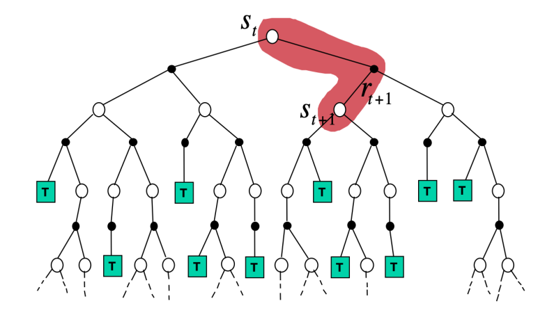
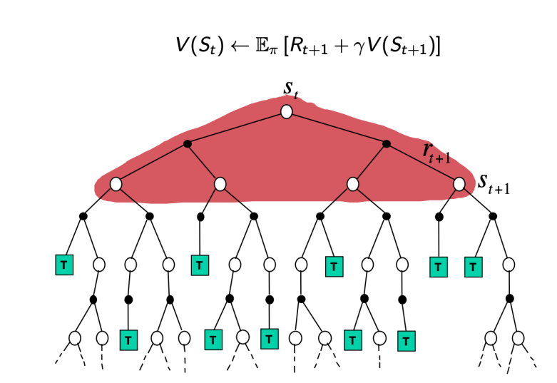

# Model-Free Estimation: Monte-Carlo and Temporal Difference

前一节我们讲过如何进行 Policy Evaluation，但这是基于我们能知道 $T(s,a,s^{\prime})$ 和 $R(s,a,s^{\prime})$ 的前提的，这种方法被称为是 model-based 的。由于大部分情况下我们并不知道 $T(s,a,s^{\prime})$ 和 $R(s,a,s^{\prime})$，我们需要 model-free 的方法来进行 Policy Evaluation。但因为 $T(s,a,s^{\prime})$ 和 $R(s,a,s^{\prime})$ 往往是带有概率的，model-free 的方法通常只能 estimate value function，而不能精确地进行 Policy Evaluation。显然，在 model-free 的情况下，agent 只能通过与环境交互来得到信息，再利用这些信息得到 value function。

## Model-free Estimation: Monte-Carlo Learning

我们想要做的事情是在已知很多 episodes of experience under policy $\pi$ 的情况下，学出 $v_{\pi}$。Episodes of experience 用 trajectories 来表示：

$$s_1, a_1, r_1, s_2, a_2, r_2, ..., s_T, a_T, r_T, s_{T+1} \sim \pi$$

即在 $s_t$ 状态时做出 action $a_t$，转移到 $s_{t+1}$ 的同时得到 reward $r_t$。定义时刻 $t$ 的 return 为：

$$G_t=r_{t}+\gamma r_{t+1} + \gamma^2 r_{t+2} + ... +\gamma^{T-t} r_T$$

那么就可以用 Monte-Carlo 的方法估计出 $v_{\pi}(s)$：

$$v_{\pi}(s)=\mathbb{E}_{\pi}[G_t|S_t=s]$$

即对任意一个状态 $s$，需要在样本中找到每一个 $s$，计算每一个 $s$ 对应的 return $G_t$，再将其进行平均。实际计算中，可以存这么几个量：

- Increment counter $N(s)\leftarrow N(s)+1$
- Increment total return $S(s)\leftarrow S(s)+G_t$
- Estimated Value $V(s)=S(s)/N(s)$

当 $N(s)\to \infty$ 的时候，$V(s)\to v_{\pi}(s)$。

存了以上 $N(s)$ 和 $V(s)$ 之后，当获取到新的样本时，就可以通过以下式子直接得出新的 $N(s)$ 和 $V(s)$:

$$N(s)\leftarrow N(s)+1$$
$$V(s)\leftarrow \frac{(N(s)-1)V(s)+G_t}{N(s)}$$

MC Learning 的好处在于它非常简单，但是它要求每个 episode sample 都必须要终止，否则无法得到 $G_t$。并且它由于没有利用 Bellman Equation，对样本的利用效率非常低，需要大量样本才能得到比较好的近似值。

## Model-free Estimation: Temporal Difference Learning

TD 与 MC 不同，它并不要求每个 episode sample 都是终止的。TD 每得到一个 transition 就会进行一次更新：

$$V(S_t)\leftarrow V(S_t)+\alpha(R_t+\gamma V(S_{t+1})-V(S_t))$$

这种更新方法被称为 TD(0)（后面还会介绍 TD($\lambda$)）。式子中 $\alpha$ 被称为 learning rate，$R_t+\gamma V(S_{t+1})$ 被称为 TD target，$\delta_t=R_t+\gamma V(S_{t+1})-V(S_t)$ 被称为 TD error。

相较于 MC，TD 利用了 Bellman Equation。因为当 $\alpha$ 很小，样本量很大的时候，$V(s)$ 会趋向于平衡点 $\sum_{s^{\prime}}T(s,\pi(s),s^{\prime})[R(s,\pi(s),s^{\prime})+\gamma V(s^{\prime})]$，这就是 Bellman Equation 中给定的 $V(s)$。

## 对比 MC 与 TD

### Bias and Variance

先来比较两种方法的 bias 和 variance。MC 中 $G_t$ 是实际值 $v_{\pi}(s_t)$ 的 unbiased estimate。而 TD 中，尽管 $R_{t+1}+\gamma v_{\pi}(s_{t+1})$ 也是 $v_{\pi}(s_t)$ 的 unbiased estimate，但我们实际计算时不知道 $v_{\pi}(s_{t+1})$，而是用的当前值 $V(s_{t+1})$。$R_{t+1}+\gamma V(s_{t+1})$ 是 $v_{\pi}(s_t)$ 的 biased estimate。

但另一方面，TD 的 variance 是比 MC 要小的。所以 MC has high variance, zero bias；TD has low variance, some bias。

### Initial Value

TD(0) 在计算时需要给定 initial value $V(s)$，由于之后的更新是依赖于当前的 $V(s)$ 的，所以 initial value 如果给得不好会影响 TD(0) 的收敛速度。而 MC 中 initial value 的影响则较小。

### Sample Efficiency

由于利用了 Bellman Equation，TD 的对样本的利用较 MC 来说更为充分，所以在样本比较少的时候可以选择用 TD。

### Visualization

三种方法 MC，TD，Value Iteration 的 visualization 如上图所示。可以看出，MC 每次更新利用了一个 trajectory 从头到尾的数据，而 TD 则利用只利用了一个 step 的数据。我们将 MC 与 TD 的更新式子写成类似的形式：

- MC: $V(S_t)\leftarrow V(S_t)+\alpha(G_t-V(S_t))$，其中 $G_t=R_{t}+\gamma R_{t+1} + \gamma^2 R_{t+2} + ... +\gamma^{T-t} R_T$, $\alpha = \frac{1}{N(S_t)}$。
- TD: $V(S_t)\leftarrow V(S_t)+\alpha(R_{t+1}+\gamma V(S_{t+1})-V(S_t))$。

我们定义从 $S_t$ 开始走过 $n$ 步的 return，$n$-step return 为：
$$G_t^{(n)}=R_{t}+\gamma R_{t+1} + ... + \gamma^{n-1} R_{t+n-1} + \gamma^{n} V(S_{t+n})$$

那么 MC 可以被写成：
$$V(S_t)\leftarrow V(S_t)+\alpha(G_t^{(\infty)}-V(S_t))$$

TD 可以被写成：
$$V(S_t)\leftarrow V(S_t)+\alpha(G_t^{(1)}-V(S_t))$$

当然 $n$ 除了取 1 和 $\infty$ 还可以取别的值，即 $n$-step TD：
$$V(S_t)\leftarrow V(S_t)+\alpha(G_t^{(n)}-V(S_t))$$

## TD($\lambda$): Combination of TD and MC

我们并不好决定在何时用 TD，何时用 MC。如果当前估计的 $V(s)$ 已经很好了，可以用 TD；但如果当前的值不好，用 MC 更合适。但是否有一种方法，可以将 MC 与 TD 的优点结合起来呢？可以采用 TD($\lambda$)。

先介绍 $\lambda$-return $G_{t}^{\lambda}$，其将所有的 $n$-step return 结合起来：

$$G_t^{\lambda}=(1-\lambda)\sum_{n=1}^{\infty}\lambda^{n-1}G_t^{(n)}$$

基于 $G_t^{\lambda}$ 提出 TD($\lambda$)：
$$V(S_t)\leftarrow V(S_t)+\alpha(G_t^{\lambda}-V(S_t))$$

通过整合所有的 $n$-step return，TD($\lambda$) 在 bias 和 variance 之间做出了一个折中，使得二者均不会太大。

可以看出，$\lambda=0$ 时，TD($\lambda$) 退化为了 TD(0)。

### Computation Trick

看起来，TD($\lambda$) 似乎丢失了 TD(0) 一个很好的特性。TD(0) 并不需要一整个 episode 的数据，只需要得知当前的一个 transition 就可以进行一次更新，而 TD($\lambda$) 似乎需要整个 episode 的数据才能得到 $G_t^{\lambda}$ 从而完成一次更新。事实上，这个问题可以通过计算上的 trick 来解决。

正常的计算思路是，在 update $V(S_t)$ 时，去查看所有 $\tau>t$ 时刻的 transition，然后对 $t$ 时刻的 value function 进行更新。这种方法是 forward 的，但事实上也可以采取 backward 的计算方法，即得到 $\tau$ 时刻的 transition 时，去更新所有 $t<\tau$ 时刻的 value function。先重写 $G_t^{\lambda}-V(S_t)$：

$$\begin{align*}
G_t^{\lambda}-V(S_t)=-V(S_t)&+(1-\lambda)\lambda^0(R_t+\gamma V(S_{t+1}))\\\\
                            &+(1-\lambda)\lambda^1(R_t+\gamma R_{t+1}+\gamma^2 V(S_{t+2}))\\\\
                            &+(1-\lambda)\lambda^2(R_t+\gamma R_{t+1}+\gamma^2 R_{t+2}+\gamma^3 V(S_{t+3}))\\\\
                            &+ ... \\\\
                    =-V(S_t)&+(\gamma\lambda)^0(R_t+\gamma V(S_{t+1})-\gamma\lambda V(S_{t+1}))\\\\
                            &+(\gamma\lambda)^1(R_{t+1}+\gamma V(S_{t+2})-\gamma\lambda V(S_{t+2}))\\\\
                            &+(\gamma\lambda)^2(R_{t+2}+\gamma V(S_{t+3})-\gamma\lambda V(S_{t+3}))\\\\
                            &+ ... \\\\
                    =(\gamma\lambda)^0&(R_t+\gamma V(S_{t+1})-V(S_t))\\\\
                            &+(\gamma\lambda)^1(R_{t+1}+\gamma V(S_{t+2})-V(S_{t+1}))\\\\
                            &+(\gamma\lambda)^2(R_{t+2}+\gamma V(S_{t+3})-V(S_{t+2}))\\\\
                            &+ ... \\\\
                    =\delta_t&+\gamma\lambda\delta_{t+1}+(\gamma\lambda)^2\delta_{t+2}+ ... 
\end{align*}$$

所以 backward 的计算方法是，在得到 $\tau$ 时刻的 transition 时，先计算出相应的 $\delta_{\tau}$，再对所有 $t<\tau$ 时刻的 value function 进行一次更新：
$$V(S_t)\leftarrow V(S_t)+\alpha\delta_{\tau}(\gamma\lambda)^{\tau-t}$$