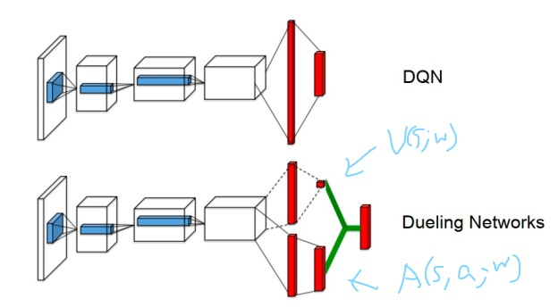
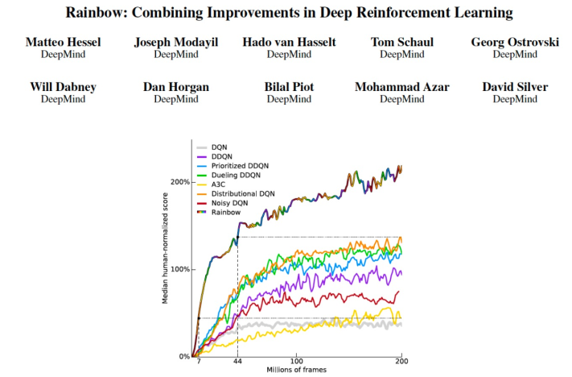
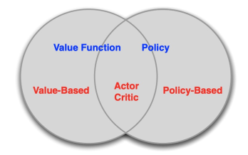

# Advanced DQN and Policy Gradient

## DQN Variants

本节我们先来介绍一下 DQN 的几种 variants。

### Double DQN

在加入 Target Network 后，DQN 的 loss function 为：

$$\mathcal{L}(w)=\left(r_t+\gamma\max_{a^{\prime}}Q(s_{t+1}, a^{\prime}; w^-)-Q(s_t, a_t; w)\right)^2$$

在 $Q(s, a; w)$ 收敛的过程中，我们可以将其视为一个随机变量，其值随着 $w$ 的变化而上下浮动，以真值 $\hat{Q}(s,a)$ 为期望。由于采用了 Experience Replay，同一个 transition 会在 $w$ 不同的时候被多次计算，我们实际上在以：

$$\mathbb{E}\_{w^-}\left[r_t+\gamma\max_{a^{\prime}}Q(s_{t+1}, a^{\prime}; w^-)\right]$$

为 target 优化 $Q(s_t, a_t; w)$。根据不等式：

$$\mathbb{E}(\max(X_1, X_2, ...))\geq \max(\mathbb{E}(X_1), \mathbb{E}(X_2), ...)$$

我们能得到：

$$\mathbb{E}\_{w^-}\left[r_t+\gamma\max_{a^{\prime}}Q(s_{t+1}, a^{\prime}; w^-)\right]\geq r_t+\gamma \max_{a^{\prime}} \hat{Q}(s_{t+1}, a^{\prime})$$

不等式右边才是我们想要的 target，因此可见 DQN 往往会存在 overestimation 的问题。我们使用的 target 会比实际的 target 大。

解决方法是我们用当前的 $Q$-network $w$ 来选择最好的 action，但用之前的 $Q$-network $w^-$ 来 evaluate action，即：

$$\mathcal{L}(w)=\left(r_t+\gamma Q\left(s_{t+1}, \argmax_{a^{\prime}}Q(s_{t+1}, a^{\prime}; w); w^-\right)-Q(s_t, a_t; w)\right)^2$$

这个方法被称为 Double DQN。

显然，$Q\left(s_{t+1}, \argmax_{a^{\prime}}Q(s_{t+1}, a^{\prime}; w); w^-\right)\leq \max_{a^{\prime}}Q\left(s_{t+1}, a^{\prime}; w^-\right)$。因此相较于 DQN，Double DQN 可以在一定程度上缓解 overestimation 带来的影响。并且当 $w^-$ 和 $w$ 收敛之后，不等式会取等。

### Prioritized Experience Replay

由于 DQN 对 replay buffer 里的 samples 学习好坏程度并不相同，有些 samples 学习得较好，有些则学习得较差。如果每次从 buffer 中取 samples 都完全随机的话，有可能会 overfit 到一些 samples 上，而另一些 samples 则几乎没学到。这样就会让训练效果变差，训练速度变慢。

解决方法是每次根据学习得好坏来对 replay buffer 进行加权采样。Store experience in priority queue according to DQN error：

$$\left|r_t+\gamma\max_{a^{\prime}}Q(s_{t+1}, a^{\prime}; w^-)-Q(s_t, a_t; w)\right|$$

对 error 进行一些函数变换之后作为 sample 的权重。这个方法被称作 Prioritized Experience Replay。

### Dueling DQN

我们定义 advantage function：

$$A^{\pi}(s,a)=Q^{\pi}(s,a)-V^{\pi}(s)$$

用来衡量 state $s$ 下，action $a$ 相较于其他的 actions 好多少。

Dueling DQN 将 $Q$-network 分为两个 channel，一个 channel 用来学习只与 state 有关的 value function $V(s;w)$；另一个 channel 学习 advantage function $A(s,a;w)$。计算 $Q$ 时将二者加起来：

$$Q(s,a;w)=V(s;w)+A(s,a;w)$$

其中 $V(s;w)$ 与 $A(s,a;w)$ 共享部分结构，如下图所示。网络的输入是 $s$ 的 vector representation，输出是大小为 $|A|$ 的向量。$V(s;w)$ 的输出在图中呈现为单个数。

### $n$-Step Return

我们先前一直用的都是 1-step return 作为 target，当然也可以用 $n$-step return：

$$\mathcal{L}(w)=\left(R_t^{n}+\gamma^n\max_{a^{\prime}}Q(s_{t+n}, a^{\prime}; w^-)-Q(s_t, a_t; w)\right)^2$$

### Rainbow

[Rainbow](https://arxiv.org/abs/1710.02298) 这篇工作总结比较了 DQN 的许多变种，并同时运用了这些 tricks 来得到较好的效果。

## Policy Gradient

相较于 $Q$-learning，DQN 已经在一定程度上解决了 $|S|$ 与 $|A|$ 较大的问题，但还不够，从 $Q$ function 得到 policy 需要对 $Q(s,a) \forall a$ 进行比较，这相当耗时。为了在更大的空间里进行 RL，我们希望直接参数化 policy：

$$\pi_{\theta}(s,a)=\mathbb{P}[a|s,\theta]$$

### Three Types of RL Methods

RL 可以根据是否学习参数化的 value/$Q$ function，是否学习参数化的 policy 分为三大类

- Value Based: Learn Value/$Q$ Function, Implicit Policy.
- Policy Based: No Value Function, Learn Policy.
- Actor-Critic: Learn Value Function, Learn Policy.

我们之前讲的方法都属于 Value Based，这部分会介绍 Policy Based Method，而下一节会讲 Actor-Critic。

### Policy Parameterization

先讲如何 parameterize $\pi_{\theta}$。

#### Softmax Policy

$$\pi_{\theta}(s,a)\propto e^{\phi(s,a)^{\top}\theta}$$

其中 $\phi(s,a)$ 是 $s,a$ 的 features，也可以用 neural networks 表示。

定义 score function 为 $\nabla_{\theta}\log \pi_{\theta}(s,a)$ （后面的推导中会看到为何要这么定义）。那么 softmax policy 的 score function 为：

$$\nabla\_{\theta}\log \pi\_{\theta}(s,a)=\phi(s,a)-\mathbb{E}\_{\pi_{\theta}}[\phi(s,\cdot)]$$

#### Gaussian Policy

一个更广泛运用的 parameterized policy 是 Gaussian Policy，其只适用于 continuous actions。

Action 的均值为 $\mu(s)=\phi(s)^{\top}\theta$，其中 $\phi(s)$ 是 $s$ 的 features，也可以用 neural networks 表示。

Action 的方差为 $\sigma^2$，可以是固定的，也可以是 parameterized 的。

Action 从高斯分布中采样，$a\sim \mathcal{N}(\mu(s), \sigma^2)$。

Score function:

$$\nabla\_{\theta}\log \pi\_{\theta}(s,a)=\frac{(a-\mu(s))\phi(s)}{\sigma^2}$$

### Policy Objective Functions

既然要学习参数化的 policy $\pi_{\theta}(s,a)$，那么该如何衡量 policy 的好坏，如何定义 objective function to maximize。一种可行的定义方法是 average reward per time-step：

$$J_{avR}(\theta)=\sum_{s}d^{\pi_{\theta}}(s)\sum_a\pi_{\theta}(s,a)r(s,a)$$

这里，$d^{\pi_{\theta}}$ 是 MDP 在 $\pi_{\theta}$ 下的稳定分布。

不过，在 model-free 的情况下我们无法得知 $d^{\pi_{\theta}}$，另一种较为直接的办法就是 maximize expected return of trajectories：

$$J(\theta)=\mathbb{E}\_{\tau}[R(\tau)]$$

### Gradient of Objective Functions

为了更新 policy，我们需要对 objective funcion 进行 gradient ascent：

$$\Delta \theta = \alpha \nabla_{\theta}J(\theta)$$

接下来就对这个导数进行推导。

$$\begin{align*}
\nabla_{\theta}J(\theta)&=\nabla_{\theta}\sum_{\tau}\mathbb{P}(\tau|\theta)R(\tau)\\\\
                        &=\sum_{\tau}R(\tau)\nabla_{\theta}\mathbb{P}(\tau|\theta)\\\\
                        &=\sum_{\tau}R(\tau)\mathbb{P}(\tau|\theta)\frac{\nabla_{\theta}\mathbb{P}(\tau|\theta)}{\mathbb{P}(\tau|\theta)}\\\\
                        &=\sum_{\tau}R(\tau)\mathbb{P}(\tau|\theta)\nabla_{\theta}\log\mathbb{P}(\tau|\theta)\\\\
                        &=\mathbb{E}_{\tau}\left[R(\tau)\nabla\_{\theta}\log\mathbb{P}(\tau|\theta)\right]
\end{align*}$$

假设 $\tau = s_0, a_0, r_0, s_1, a_1, ..., s_{T-1}, a_{T-1}, r_{T-1}, s_T$，那么有：

$$\mathbb{P}(\tau|\theta)=\mu(s_0)\prod_{t=0}^{T-1}\left[\pi(a_t|s_t,\theta)\mathbb{P}(s_{t+1},r_t|s_t, a_t)\right]$$

其中 $\mu(s_0)$ 是 initial distribution。取对数：

$$\log\mathbb{P}(\tau|\theta)=\log\mu(s_0)+\sum_{t=0}^{T-1}\left[\log\pi(a_t|s_t,\theta)+\log\mathbb{P}(s_{t+1},r_t|s_t, a_t)\right]$$

求导：

$$\nabla_{\theta}\log\mathbb{P}(\tau|\theta)=\nabla_{\theta}\sum_{t=0}^{T-1}\log\pi(a_t|s_t,\theta)$$

代入原式中，得到：

$$\nabla_{\theta}J(\theta)=\mathbb{E}_{\tau}\left[R(\tau)\nabla\_{\theta}\sum\_{t=0}^{T-1}\log\pi(a_t|s_t,\theta)\right]$$

在已知 $\tau$ 以及 $\pi$ 的情况下，括号中的内容可以直接算出。Expectation 则可以用 MC 来 estimate。

### REINFORCE

根据以上的推导，得出了一个 MC-based, policy-based RL method：

> **REINFORCE:**
> - sample {$\tau^i$} from $\pi_{\theta}$ (run the policy)
> - $\nabla_{\theta}J(\theta)\approx\frac{1}{|\\{\tau^i\\}|}\sum_{i}\left[R(\tau_i)\sum\_{t}\nabla\_{\theta}\log\pi_{\theta}(a_t^i|s_t^i)\right]$
> - $\theta\leftarrow \theta+\alpha\nabla_{\theta}J(\theta)$

### Baseline with REINFORCE

REINFORCE 中采用 MC 的方法进行 estimate，会导致 high variance，我们试图减小 variance。先不考虑整个 trajectory，只考虑一个 step。即减小 $r(s,a)\nabla\_{\theta}\log\pi\_{\theta}(s,a)$ 的方差。

注意到，$\forall B(s)$ irrelevant with $a$：

$$\begin{align*}
\mathbb{E}_{\pi\_{\theta}}\left[B(s)\nabla\_{\theta}\log\pi\_{\theta}(s,a)\right]&=\sum\_{a}\pi\_{\theta}(s,a)B(s)\nabla\_{\theta}\log\pi\_{\theta}(s,a)\\\\
                                                                                 &=\sum\_{a}B(s)\nabla\_{\theta}\pi\_{\theta}(s,a)\\\\
                                                                                 &=B(s)\nabla\_{\theta}\sum\_{a}\pi\_{\theta}(s,a)\\\\
                                                                                 &=B(s)\nabla\_{\theta}1\\\\
                                                                                 &=0
\end{align*}$$

故而用 $\mathbb{E}_{\pi\_{\theta}}\left[\left(r(s,a)-B(s)\right)\nabla\_{\theta}\log\pi\_{\theta}(s,a)\right]$ 来代替 $\mathbb{E}\_{\pi\_{\theta}}\left[r(s,a)\nabla\_{\theta}\log\pi\_{\theta}(s,a)\right]$ 并不会影响 expectation。并且我们可以证明，当 $B(s)$ 合适的时候，$\text{Var}\_{\pi\_{\theta}}\left[\left(r(s,a)-B(s)\right)\nabla\_{\theta}\log\pi\_{\theta}(s,a)\right] < \text{Var}\_{\pi\_{\theta}}\left[r(s,a)\nabla\_{\theta}\log\pi\_{\theta}(s,a)\right]$：

$$\begin{align*}
&\text{Var}\_{\pi\_{\theta}}\left[\left(r(s,a)-B(s)\right)\nabla\_{\theta}\log\pi\_{\theta}(s,a)\right] - \text{Var}\_{\pi\_{\theta}}\left[r(s,a)\nabla\_{\theta}\log\pi\_{\theta}(s,a)\right]\\\\
=&\mathbb{E}\_{\pi\_{\theta}}\left[\left(r(s,a)-B(s)\right)\nabla\_{\theta}\log\pi\_{\theta}(s,a)\right]^2 - \mathbb{E}\_{\pi\_{\theta}}\left[r(s,a)\nabla\_{\theta}\log\pi\_{\theta}(s,a)\right]^2\\\\
=&\mathbb{E}\_{\pi\_{\theta}}\left[\left(B(s)^2-2r(s,a)B(s)\right)\left(\nabla\_{\theta}\log\pi\_{\theta}(s,a)\right)^2\right]\\\\
=&B(s)^2\mathbb{E}\_{\pi\_{\theta}}\left[\nabla\_{\theta}\log\pi\_{\theta}(s,a)\right]^2-2B(s)\mathbb{E}\_{\pi\_{\theta}}\left[r(s,a)\left(\nabla\_{\theta}\log\pi\_{\theta}(s,a)\right)^2\right]
\end{align*}$$

这是个二次函数，当 $B(s)=\frac{\mathbb{E}\_{\pi\_{\theta}}\left[r(s,a)\left(\nabla\_{\theta}\log\pi\_{\theta}(s,a)\right)^2\right]}{\mathbb{E}\_{\pi\_{\theta}}\left[\nabla\_{\theta}\log\pi\_{\theta}(s,a)\right]^2}$ 时，两个 Variance 的差取最小值，小于0。

$B(s)$ 称为 baseline。在 REINFORCE 中，选择一个合适的 constant baseline 也可以 reduce variance：

$$\nabla_{\theta}J(\theta)=\mathbb{E}_{\tau}\left[(R(\tau)-B)\nabla\_{\theta}\sum\_{t=0}^{T-1}\log\pi(a_t|s_t,\theta)\right]$$
