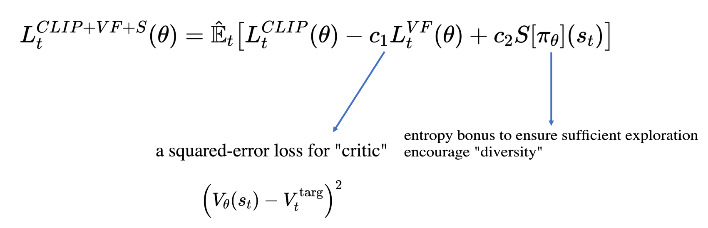

# Proximal Policy Optimization

Proximal Policy Optimization (PPO) 的 objective function:

$$\max_{\theta}\left( \mathbb{E}\_t\left[\frac{\pi\_{\theta}(a_t|s_t)}{\pi\_{\theta\_{\text{old}}}(a_t|s_t)} A^{\pi\_{\text{old}}}\_t\right] - \beta \mathbb{E}\_t\left[\textbf{KL}[\pi_{\theta_{\text{old}}}(\cdot|s_t), \pi_{\theta}(\cdot|s_t)]\right]\right)$$

其中第二项是为了保证 $\pi$ 在更新时不要发生太大的变化，这样可以让训练更稳定。

## Adaptive KL Penalty

系数 $\beta$ 是可以调节的，用于调节 KL penalty 的比重，也可以 adaptively 调节。比如令

$$d = \mathbb{E}\_t\left[\textbf{KL}[\pi_{\theta_{\text{old}}}(\cdot|s_t), \pi_{\theta}(\cdot|s_t)]\right]$$

再设定一个目标 $d_{\text{targ}}$，

- 当 $d<d_{\text{targ}}/1.5$ 时，$\beta\leftarrow \beta/2$。
- 当 $d>d_{\text{targ}}\times 1.5$ 时，$\beta\leftarrow \beta\times 2$。

### PPO with Clipped Objective

为了让训练更加稳定，对 $r_t=\frac{\pi\_{\theta}(a_t|s_t)}{\pi\_{\theta\_{\text{old}}}}$ 进行 clip：

$$L^{\text{CLIP}}=\mathbb{E}\_t\left[\min \left(r_t A^{\pi\_{\text{old}}}\_t, \text{clip}(r_t, 1-\epsilon, 1+\epsilon) A^{\pi\_{\text{old}}}\_t\right)\right]$$

### PPO in Practice

一般在使用时，会在 CLIP 项后额外加两项，而 KL divergence 则作为调节 learning rate 的判据 （KL小就调大 lr，KL大就调小 lr）。

