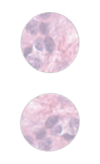

最近在做一个将对称性与 RL 结合的工作，其中将 PPO 里的 actor-critic 网络换成了具有对称性的 EMLP (equivariant MLP)。EMLP 的效果就是，对于具有对称性的输入，其保证输出也具有对称性。EMLP 利用 [escnn](https://github.com/QUVA-Lab/escnn) 库实现。我在 escnn 库的 README.md 里找到了 Amsterdam 大学的一个暑期课程 [An Introduction to Group Equivariant Deep Learning](https://uvagedl.github.io/)，感觉是个很有趣的领域，于是打算学习一下并记点笔记。

# Lecture 1 Regular group convolutional neural networks

# Lecture 1.1 Introduction

其实 DL 中的许多问题都要求对于以某种方式对称后的输入，网络的输出也具有某种对称性（或不变性）。比如对于肿瘤细胞的识别：给定一张细胞的图片，要求判断其是否为恶性肿瘤细胞。我们希望图像旋转后，判断的结果保持不变。

一个最直接的办法就是 data augmentation，对于训练集中的一张图片，将其经过若干种旋转后的图片都加到训练集中。尽管这样可以在一定程度上解决问题，但是这种方法仍没有完全保证输出关于对称输入的不变性 (invariance)，而且其将有限的网络 capacity 用于学习对称性上，在相同的参数量下可能会造成 capacity 的下降。因此我们希望直接在网络层面保证对称性。

我们已经知道 CNN 具有平移对称性，即对于平移一定距离的输入，CNN 的输出也具有相同方向、相同距离的平移。但如下图所示， CNN 并不具备旋转对称性。其中 input 即为输入的图像，feature map 是 CNN 的原始输出，stabilized view 是将 feature map 转回到原来的角度。对于旋转后的图像，CNN 的输出并不稳定，即 stabilized view 并不保持不变。

我们希望构造一个 CNN 网络结构 (Group equivariant CNN)，使得 CNN 具有旋转对称性，如下图所示。

