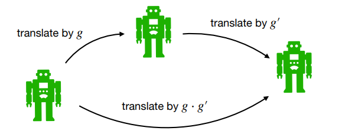
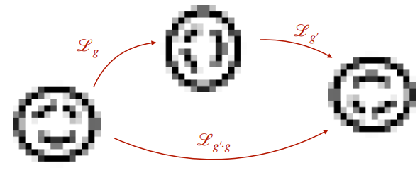
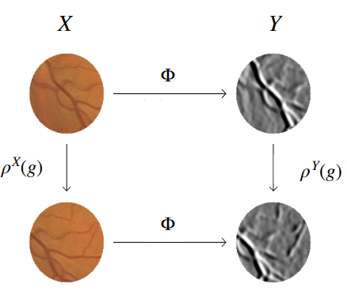

# Lecture 1.2 Group Theory | The basics

先介绍一下群论里的一些概念。

## Group

一个群 (group) $(G, \cdot)$ 是一个元素集合 $G$ 加上定义在 $G$ 中元素上的二元运算 $\cdot$。二元运算 $\cdot$ 满足以下四条性质：
- **Closure:** 对于 $\forall g, h \in G$, 它们的积 $g\cdot h\in G$。
- **Associativity:** 对于 $\forall g,h,i \in G, \cdot$ 满足结合律，$g\cdot (h\cdot i)=(g\cdot h)\cdot i$。
- **Indentity element:** 存在一个 identity element $e\in G$，满足对于 $\forall g\in G, e\cdot g=g\cdot e=g$。
- **Inverse element:** 对于 $\forall g\in G$，其都有 inverse element $g^{-1}\in G$ s.t. $g^{-1}\cdot g=g \cdot g^{-1}=e$。

### Translation group $(\mathbb{R}^2, +)$

Translation group 中的元素即为 $\mathbb{R}^2$ 中的点，对于 $g=(\mathbf{x}), g^{\prime}=(\mathbf{x}^{\prime})$，其中 $\mathbf{x},\mathbf{x}^{\prime}\in \mathbb{R}^2$，我们有：

$$g\cdot g^{\prime}=(\mathbf{x}+\mathbf{x}^{\prime})$$
$$g^{-1}=(-\mathbf{x})$$

Translation group 中的一个元素可以被视为一个平移变换 （Lecture 1.6 中会细讲）。

### Roto-translation group $SE(2)$ (2D Special Euclidean motion group)

$SE(2)=\mathbb{R}^2\rtimes SO(2)$，其中的每个元素 $g=(\mathbf{x}, \mathbf{R}\_{\theta} )$ 由一个二维向量 $\mathbf{x}\in \mathbb{R}^2$ 以及一个二维旋转矩阵 $\mathbf{R}\_{\theta} \in SO(2)$ 组成。对于 $g=(\mathbf{x}, \mathbf{R}\_{\theta}) , g^{\prime}=(\mathbf{x}^{\prime}, \mathbf{R}\_{\theta^{\prime}} )$，我们有：

$$g\cdot g^{\prime}=(\mathbf{x}, \mathbf{R}\_{\theta}) \cdot (\mathbf{x}^{\prime}, \mathbf{R}\_{\theta^{\prime}})=(\mathbf{R}\_{\theta}\mathbf{x}^{\prime}+\mathbf{x}, \mathbf{R}\_{\theta+\theta^{\prime}} )$$

$$g^{-1}=(-\mathbf{R}\_{\theta}^{-1} \mathbf{x}, \mathbf{R}\_{\theta}^{-1} )$$

$SE(2)$ 中的一个元素可以被视为一个旋转变换加上一个平移变换。

.png)

- **矩阵表示：** $SE(2)$ 中的元素也可以用矩阵表示：

$$g=(\mathbf{x}, \mathbf{R}\_{\theta})\quad \leftrightarrow\quad \mathbf{G}=\begin{pmatrix} \mathbf{R}\_{\theta} & \mathbf{x}\\\\ \mathbf{0}^{\top} & 1 \end{pmatrix} = \begin{pmatrix} \cos\theta & -\sin\theta & x\\\\ \sin\theta & \cos\theta & y\\\\ 0 & 0 & 1 \end{pmatrix}$$

$$\begin{pmatrix} \mathbf{R}\_{\theta} & \mathbf{x}\\\\ \mathbf{0}^{\top} & 1 \end{pmatrix}\begin{pmatrix} \mathbf{R}\_{\theta^{\prime}} & \mathbf{x}^{\prime}\\\\ \mathbf{0}^{\top} & 1 \end{pmatrix}=\begin{pmatrix} \mathbf{R}\_{\theta+\theta^{\prime}} & \mathbf{R}\_{\theta} \mathbf{x}^{\prime}+\mathbf{x}\\\\ \mathbf{0}^{\top} & 1 \end{pmatrix}$$

### Scale-translation group $\mathbb{R}^2\rtimes\mathbb{R}^+$

$\mathbb{R}^2\rtimes\mathbb{R}^+$ 中的每个元素 $g=(\mathbf{x},s)$ 由一个二维向量 $\mathbf{x}\in\mathbb{R}^2$ 以及一个正标量 $s\in \mathbb{R}^+$ 组成。对于 $g=(\mathbf{x},s), g^{\prime}=(\mathbf{x}^{\prime}, s^{\prime})$，我们有：

$$g\cdot g^{\prime}=(s\mathbf{x}^{\prime}+\mathbf{x}, ss^{\prime})$$

$$g^{-1}=\left(-\frac{1}{s}\mathbf{x}, \frac{1}{s}\right)$$

$\mathbb{R}^2\rtimes\mathbb{R}^+$ 中的一个元素可以被视为一个缩放变换加上一个平移变换。

### Affine groups $G=\mathbb{R}^{d}\rtimes H$

Affine groups 是某个 group $H$ 和 $\mathbb{R}^d$ 的半直积。对于 $g=(\mathbf{x},h), g^{\prime}=(\mathbf{x}^{\prime}, h^{\prime})$，我们有：

$$g\cdot g^{\prime}=(h\cdot\mathbf{x}^{\prime}+\mathbf{x}, h\cdot h^{\prime})$$
$$g^{-1}=\left(-h^{-1}\cdot\mathbf{x}, h^{-1}\right)$$

上面说的 $SE(2)=\mathbb{R}^2\rtimes SO(2)$ 和 $\mathbb{R}^2\rtimes\mathbb{R}^+$ 都属于 affine groups。Affine groups 中的一个元素可以被视为一个变换 $h$ 加上一个平移变换。

## Representations

一个 representation $\rho: G\rightarrow GL(V)$ 是从 $G$ 到 $GL(V)$ 的一个群同态 (group homomorphism)。

- $GL_n$ 就是由所有 $n\times n$ 的可逆矩阵组成的群，群运算即为矩阵乘法。

这就是说 $\rho(g)$ 是由 $g\in G$ 决定的线性变换，它作用在一个向量 $\mathbf{v}\in V$ 上，具有性质：

$$\rho(g^{\prime})\circ\rho(g)[\mathbf{v}]=\rho(g^{\prime}\cdot g)[\mathbf{v}]$$

### Left-regular representations

一个 left-regular representation $\mathscr{L}_g$ 作用在一个函数 $f$ 上，定义为：

$$\mathscr{L}\_g \[f\](x):=f(g^{-1}\cdot x)$$

这么说有点抽象，举个例子。$f\in \mathbb{L}_2(\mathbb{R}^2)$ 是一个二维图像，它给 $\mathbb{R}^2$ 上的每个点赋值。$g\in G=SE(2)$ 可以被看做是一个平移变换加上一个旋转变换。对于二维平面上的一个点 $\mathbf{y}\in\mathbb{R}^2$，可以算出：

$$\mathscr{L}\_g \[f\](\mathbf{y}):=f(g^{-1}\cdot \mathbf{y})=f(\mathbf{R}\_{-\theta}(\mathbf{y}-\mathbf{x}))$$

即现在 $\mathbf{y}$ 处的函数值为先将 $\mathbf{y}$ 平移 $-\mathbf{x}$，再旋转 $-\theta$ 处的 $f$ 值。也就是说，现在的图像是由原先的图像先旋转 $\theta$ 再平移 $\mathbf{x}$ 得到的。在这种情况下 $\mathscr{L}\_g $ 也可以写做 $\mathscr{L}\_g^{SE(2)\rightarrow \mathbb{L}\_2 (\mathbb{R}^2)}$。这就是说，在给定 $f$ 的情况下，$\mathscr{L}$ 会将 $g\in SE(2)$ 转成一个二维图像 $f^{\prime}\in \mathbb{L}\_2 (\mathbb{R}^2)$。

Left-regular representations 满足性质：

$$\mathscr{L}\_{g^{\prime}}\circ\mathscr{L}\_g=\mathscr{L}\_{g^{\prime}\cdot g}$$

## Equivariance

如果一个 operator $\Phi: X\rightarrow Y$ （如一个神经网络）满足以下条件，则说其具有等变性 (equivariance)：

$$\Phi\circ \rho^X(g)=\rho^Y(g)\circ \Phi$$

即，先作用 $\Phi$ 与后作用 $\Phi$ 得到的效果是一样的。比如 $g$ 表示一个平移变换，$\Phi$ 表示用 CNN 从图片中提取特征。

