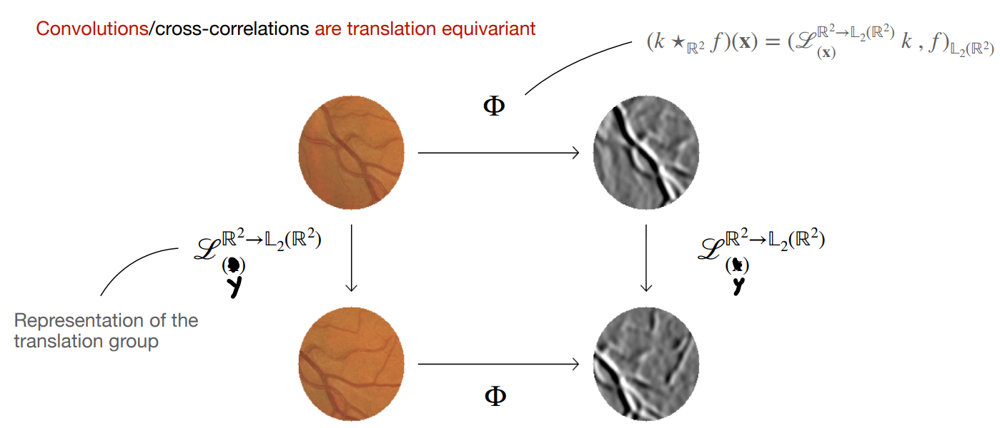
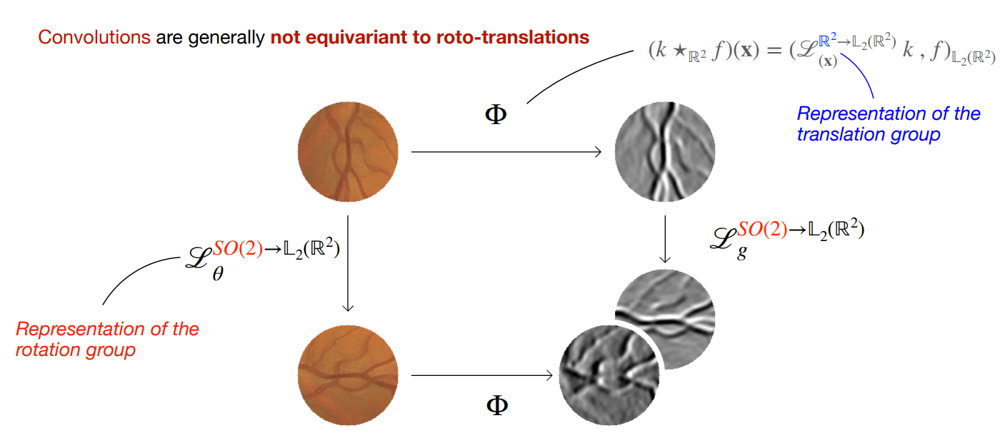
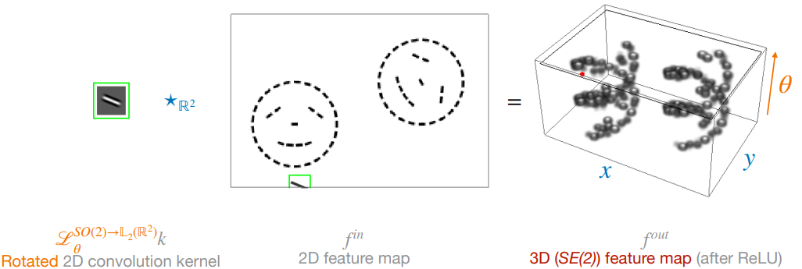
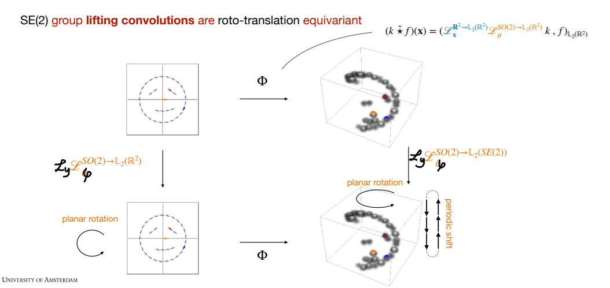
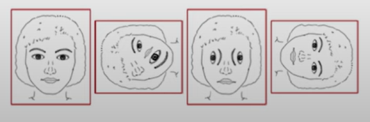
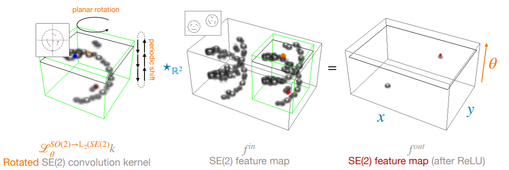
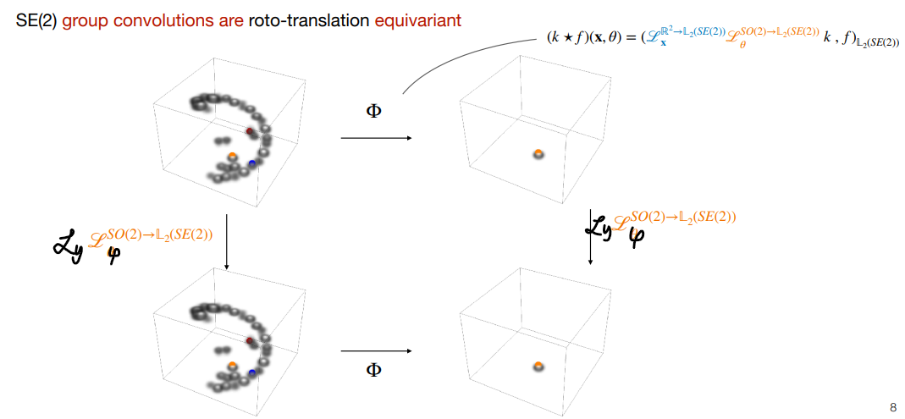

# Lecture 1.3 Regular group convolutions | Template matching viewpoint

## Cross-correlations

定义 kernel $k\in \mathbb{L}\_2(\mathbb{R}^2)$ 和二维图像 $f\in \mathbb{L}\_2(\mathbb{R}^2)$ 之间的 cross-correlations 为：

$$(k\star\_{\mathbb{R}^2} f)(\mathbf{x})=\int\_{\mathbb{R}^2} k(\mathbf{x}^{\prime}-\mathbf{x})f(\mathbf{x}^{\prime})\mathrm{ d} \mathbf{x}^{\prime}=(\mathscr{L}\_{\mathbf{x}} k, f)\_{\mathbb{L}\_2 (\mathbb{R}^2)}$$

RHS 的标记是定义出来的。

- **Note:** 这其实就是 CNN 中的 convolution，但并不是严格意义上的 convolution，严格意义上的 convolution 为：

$$\int\_{\mathbb{R}^2} k(\mathbf{x}-\mathbf{x}^{\prime})f(\mathbf{x}^{\prime})\mathrm{ d} \mathbf{x}^{\prime}$$

## Equivariance

Convolutions/cross-correlations 具有平移等变性，即对于 $\forall \mathbf{x}, \mathbf{y}\in \mathbb{R}^2$，有

$$\mathscr{L}\_{\mathbf{y}}^{\mathbb{R}^2\rightarrow \mathbb{L}\_2(\mathbb{R}^2)}[(k\star\_{\mathbb{R}^2}f)(\mathbf{x})]=(k\star\_{\mathbb{R}^2}\mathscr{L}\_{\mathbf{y}}^{\mathbb{R}^2\rightarrow \mathbb{L}\_2(\mathbb{R}^2)}f)(\mathbf{x})$$

> Proof: 
> $$LHS=(k\star\_{\mathbb{R}^2} f)(\mathbf{x}-\mathbf{y})=(\mathscr{L}\_{\mathbf{x}-\mathbf{y}}^{\mathbb{R}^2\rightarrow \mathbb{L}\_2 (\mathbb{R}^2)} k, f)_{\mathbb{L}\_2 (\mathbb{R}^2)}=(\mathscr{L}\_{\mathbf{x}}^{\mathbb{R}^2\rightarrow \mathbb{L}\_2 (\mathbb{R}^2)} k, \mathscr{L}\_{\mathbf{y}}^{\mathbb{R}^2\rightarrow \mathbb{L}\_2 (\mathbb{R}^2)} f)\_{\mathbb{L}\_2 (\mathbb{R}^2)}=RHS$$

一般情况下，卷积操作对于旋转操作并不具有等变性。

$$\mathscr{L}\_{\theta}^{SO(2)\rightarrow \mathbb{L}\_2(\mathbb{R}^2)}[(k\star\_{\mathbb{R}^2}f)(\mathbf{x})]\neq (k\star\_{\mathbb{R}^2}\mathscr{L}\_{\theta}^{SO(2)\rightarrow \mathbb{L}\_2(\mathbb{R}^2)}f)(\mathbf{x})$$

## Regular group CNN

接下来，我们从构造 roto-translation equivariant 的卷积操作入手，一步步搭建 regular group CNN。

### Lifting correlations

首先，cross-correlation 可以写为：

$$(k\star\_{\mathbb{R}^2} f)(\mathbf{x})=(\mathscr{L}\_{\mathbf{x}}^{\mathbb{R}^2\rightarrow \mathbb{L}\_2 (\mathbb{R}^2)} k, f)\_{\mathbb{L}\_2 (\mathbb{R}^2)}$$

类似地，对于 $\forall k, f\in \mathbb{L}\_2 (\mathbb{R}^2)$，我们定义 lifting correlations 为：

$$(k\tilde{\star} f)(\mathbf{x}, \theta)=(\mathscr{L}\_{(\mathbf{x},\theta)}^{SE(2)\rightarrow \mathbb{L}\_2 (\mathbb{R}^2)} k, f)\_{\mathbb{L}\_2 (\mathbb{R}^2)}=(\mathscr{L}\_{\mathbf{x}}^{\mathbb{R}^2\rightarrow \mathbb{L}\_2 (\mathbb{R}^2)} \mathscr{L}\_{\theta}^{SO(2)\rightarrow \mathbb{L}\_2 (\mathbb{R}^2)} k, f)\_{\mathbb{L}\_2 (\mathbb{R}^2)}$$

这就相当于将 kernel $k$ 的每一种旋转以及每一种平移都与 $f$ 做一次点积操作，最后得到一个 3D feature map。

Lifing correlations 具有 roto-translation 等变性，即（省略上标）：

$$\mathscr{L}\_{\mathbf{y}} \mathscr{L}\_{\varphi} (k\tilde{\star} f)(\mathbf{x}, \theta) = (k\tilde{\star} \mathscr{L}\_{\mathbf{y}} \mathscr{L}\_{\varphi} f)(\mathbf{x}, \theta)$$

> Proof: 
> $$LHS=(k\tilde{\star} f)(\mathbf{y},\varphi)^{-1} (\mathbf{x},\theta)=(\mathscr{L}\_{\mathbf{y}} \mathscr{L}\_{\varphi} \mathscr{L}\_{\mathbf{x}} \mathscr{L}\_{\theta} k, f)\_{\mathbb{L}\_2 (\mathbb{R}^2)}=(\mathscr{L}\_{\mathbf{x}} \mathscr{L}\_{\theta} k, \mathscr{L}\_{\mathbf{y}} \mathscr{L}\_{\varphi} f)\_{\mathbb{L}\_2 (\mathbb{R}^2)}=RHS$$

### Group correlations

Lifting correlations 可以学到 low-level features，比如要匹配人脸，某个 kernel 可能学到了眼睛，某个 kernel 可能学到了鼻子。如果此时直接对 $\theta$ 轴进行投影，各部分不同的朝向可能会导致相同的投影，如下图所示。

所以需要后续的 layers 用其他 kernels 来匹配全局信息。对于 $\forall k, y \in \mathbb{L}\_2 (SE(2))$，定义 group correlations 为：

$$(k\star f)(\mathbf{x}, \theta)=(\mathscr{L}\_{(\mathbf{x},\theta)}^{SE(2)\rightarrow \mathbb{L}\_2 (SE(2))} k, f)\_{\mathbb{L}\_2 (SE(2))}=(\mathscr{L}\_{\mathbf{x}}^{\mathbb{R}^2\rightarrow \mathbb{L}\_2 (SE(2))} \mathscr{L}\_{\theta}^{SO(2)\rightarrow \mathbb{L}\_2 (SE(2))} k, f)\_{\mathbb{L}\_2 (SE(2))}$$

Group correlations 将两个 3D feature maps 映射为一个 3D feature map。

类似可以证明，group correlations 也是 roto-translation equivalent 的。

