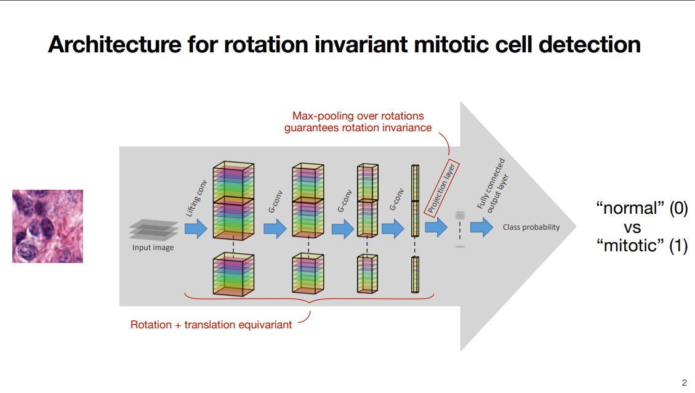
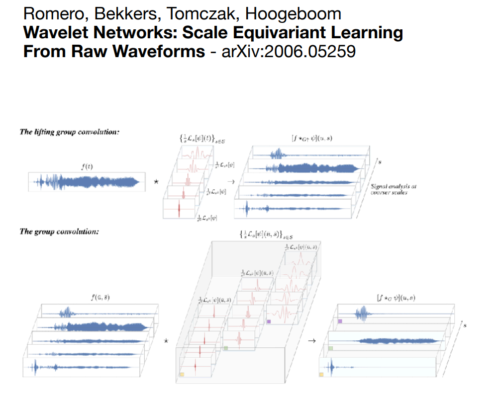

# Lecture 1.4 SE(2) Equivariant NN Example | histopathology

本节以有丝分裂细胞识别为例（即给一张细胞的图片，判断其是否正在进行有丝分裂），构造一个 rotation invariant CNN。对于一张图片的不同旋转版本，网络需要返回同样的输出。

## Invariance

我们在 Lecture 1.2 节已经介绍过等变性 (equivariance)，即对于一个 operator $\Phi: X\rightarrow Y$，其具有以下的性质：

$$\Phi\circ \rho^X(g)=\rho^Y(g)\circ \Phi$$

而不变性 (invariance) 则是：

$$\Phi\circ \rho^X(g)=\Phi$$

即不论输入在经过 $\Phi$ 之前是否经过 $\rho^X(g)$，其最终输出都是一样的。

## 网络架构

网络架构如上图所示，对于一张图片，将其经过一层 lifting convolution 和几层 group convolution 后，每个 output channel 都只含有一个 $ 1\times |G| $ 的向量。通过这样的操作抹去了 $x, y$，只留下了 $\theta$ 轴。由于中间的每一层都是 equivariant 的，因此对于不同旋转角度的输入，这一层的输出仅仅是在 $\theta$ 轴上有不同的平移。为了消除 $\theta$ 轴向平移的影响，在后面再加一层 projection layer （或者说是 pooling layer），在 $\theta$ 方向取 mean 或 max 等等。

此时我们就得到了一个 $1 \times \# \text{ output channel}$ 的向量，此时的输出结果是 roto-invariant 的，可以直接在后面加一个 linear 层进行 classification。

也可以在每层之后加一层 pointwise non-linear layer，这显然不会改变 equivariance。

- **Note:** 这样构造出来的 CNN 的网络大小是正比于 $|G|$ 的。比如如果希望构造一个完全 rotational invariant 的网络，$|G|$ 的大小即旋转的度数的个数，是无穷的，这样的网络无法达到效果。这里实现的只是取了几个旋转角度，比如 $0, \frac{\pi}{2}, \pi, \frac{3\pi}{2}$。后续讲的网络可以解决这个问题。

## From rotation to scale equivariant CNNs

上面我们展示了 roto-translation equivariant CNN 的作用，除此以外，scale equivariant CNN 也有其用处， 比如可以识别不同大小的人脸、不同音量音高的音频。

## 效果

- G-CNN 可以**保证**输出的等变性。
- G-CNN 可以获得比单纯用 data-augmentation 更好的效果。比如要进行人脸识别，训练集里某一张图片有两张人脸，data-augmentation 可以识别将两张人脸作为一个整体旋转得到的图片，而 G-CNN 可以识别两张人脸分别旋转得到的图片。
- G-CNN 增加了 sample efficiency。