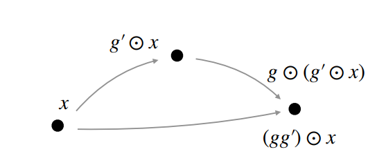
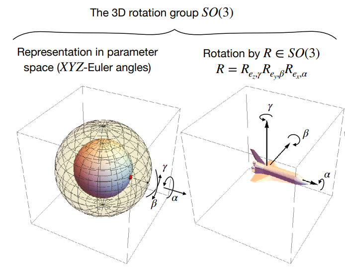
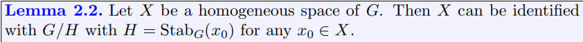

# Lecture 1.6 Group Theory | Homogeneous/quotient spaces

这一节为后面的内容做准备，再来介绍一下 group theory。

## Group action

group action 是一个 operator $\odot: G\times X\rightarrow X$，其满足以下性质：

$$\forall g, g^{\prime}\in G, \forall x\in X, \quad g\odot (g^{\prime}\odot x)=(gg^{\prime})\odot x$$

## Transitive action

称一个 group action $\odot$ 具有传递性 (transitivity)，当其满足：

$$\forall x_0, x\in X, \exists g\in G, \quad x=g\odot x_0$$

比如 $(\mathbb{R}^2,+)$ 作用在 $\mathbb{R}^2$ 上，$SE(2)$ 作用在 $\mathbb{R}^2$ 上都是 transitive 的。但 $SO(2)$ 作用在 $\mathbb{R}^2$ 上不是。

## Homogeneous space

如果一个群 $G$ 能够传递地作用在空间 $X$ 上，则称 $X$ 是 $G$ 的一个 homogeneous space。

这个性质很重要，因为卷积可以被视为对 kernel 作用 $G$ 中的每个元素后与输入 $f$ 进行点积，只有 $f$ 的定义域是 $G$ 的一个 homogeneous space 的时候，才能保证 $f$ 中的所有信息能被卷积提取出来。

比如对于普通的二维卷积操作，正是因为 $\mathbb{R}^2$ 是 $(\mathbb{R}^2,+)$ 的一个 homogeneous space，kernel 才能遍历 $f$ 的每个点。对于 lifting correlation 也是一样，$\mathbb{R}^2$ 是 $SE(2)$ 的一个 homogeneous space。

可以定义三维旋转群 $SO(3)$ 作用在三维向量（起点为原点） $\mathbb{R}^3$ 上的 group action，roll 对应向量的伸缩，pitch 和 yaw 对应向量方向的旋转。若将作用后的三维向量投影到三维球面 $S^2$ 上，可以发现 $S^2$ 是 $SO(3)$ 的一个 homogeneous space。

## Quotient space

对于群 $G$ 以及其正规子群 $H$，定义 quotient space/group 为：

$$G/H=\left\\{\\{gh|h\in H\\}| g\in G\right\\}$$

$G/H$ 中的元素是集合。

其实在 $SO(3)$ 作用在 $S^2$ 的过程中， roll 并没有起作用（无论向量如何伸缩，都会被投影回 $S^2$），所以有 $S^2\cong SO(3)/SO(2)$。

## Stabilizer

对于集合 $X$ 中的元素 $x_0$ 以及作用在 $X$ 上的群 $G$，定义 $x_0$ 的 stabilizer 为：

$$Stab\_G(x_0)=\\{g|gx\_0=x\_0\\}$$

即那些能让 $x_0$ 保持稳定的元素 $g$。

## Homogeneous space $\equiv$ Quotient space

[Slides](https://uvagedl.github.io/lectures_pdf/Lecture_1_6_GroupTheory.pdf) 中的表述为：Any quotient space is a homogeneous space. Any homogeneous space is a quotient space.

显然，quotient space 是一个 homogeneous space，因为 $G$ 可以传递地作用在 $G/H$ 上。

但第二句话的表述并不严谨，quotient space 一定是一个 group，但 homogeneous space 不一定是个 group。因此对于一个给定的 homogeneous space，无法构造一个 quotient space，使得二者同构。但可以构造一个 quotient space，使得二者之间存在 bijection。

[Lecture notes](https://uvagedl.github.io/GroupConvLectureNotes.pdf) 中对第二句话的表述为：

> Proof:
>
> 对于任意一个 $x\_0\in X$，都可以构造一个映射 $f: G/H \rightarrow X, gH \mapsto gx\_0$。
>
> 这个映射是良定义的，因为如果 $\exists g\_1, g\_2, s.t. g\_1 H=g\_2 H$，那么 $\exists h\in H, s.t. g\_1=g\_2 h$。所以 $g\_1 x\_0 = g\_2 h x\_0 = g\_2 x\_0$。
> 
> 因为 $X$ 是一个 homogeneous space，所以 $f$ 是满射。
>
> 假设 $g\_1 x\_0=g\_2 x\_0$，那么 $g\_2^{-1} g\_1 x\_0 = x\_0, g\_2^{-1} g\_1\in H$，所以 $g\_1 H = g\_2 H$。$f$ 是单射。
>
> $f$ is a bijection.