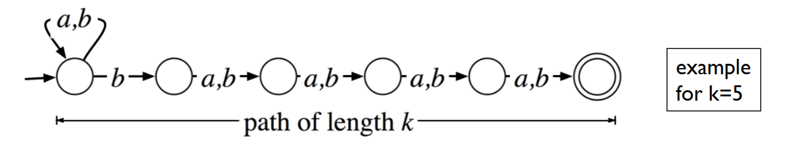
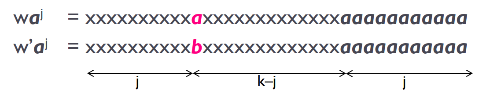
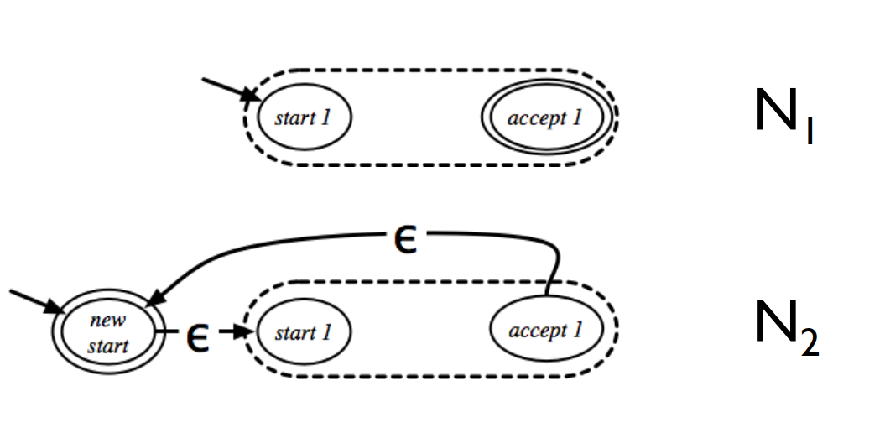
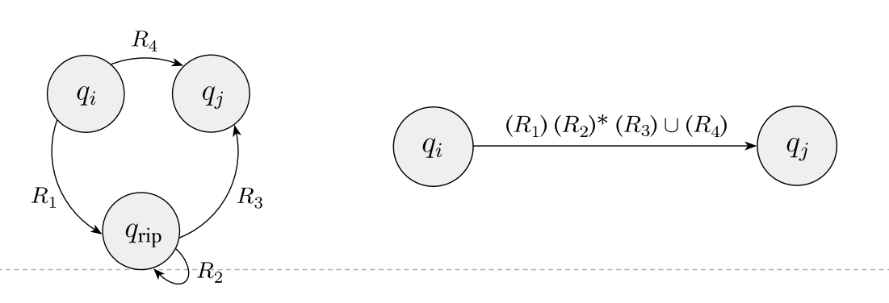

# Lecture 3 Finite Automata

计算理论剩下的笔记会是 exam-oriented 的，因为系统地写一篇笔记确实太过耗时。

## Deterministic Finite Automaton (DFA)

### DFA and Regular Languages

> **Definition:**
>
> A *DFA* is a 5-tuple $(Q, \Sigma, \delta, q, F)$:
> - $Q$ is a finite set of states.
> - $\Sigma$, the alphabet is a finite set of symbols.
> - $\delta: Q\times \Sigma \to Q$ is the transition function.
> - $q\in Q$ is the start state.
> - $F\subset Q$ is the set of accepting states.

DFA 做的事情就是从 start state 开始，每次从输出序列中获取下一个 symbol，依据 transition function 转成另一个state，直到 inputs 被获取完，判断此时的 state 是否为 accepting state。

> **Definition:**
>
> A DFA $M$ *accepts* the input $w$ if:
> - $M=(Q,\Sigma,\delta,q,F)$.
> - $w=w_1 w_2\cdots w_n$, each $w_i\in \Sigma$ for $1\leq i\leq n$.
> - $\exists (r_0, r_1, \cdots, r_n)$, each $r_i\in Q$ for $0\leq i\leq n$ s.t.
> - - $r_0 = q$, the start state.
> - - $r_i = \delta (r_{i-1}, w_i)$, for $1\leq i\leq n$.
> - - $r_n\in F$.

每个 DFA 都存在一些 inputs 的集合，使其 accepts，定义这个集合为 DFA 的 language。

> **Definition:**
>
> A *Language* is a (possibly infinite) set of strings over some alphabet.
>
> $L(M) = \\{w | M \text{ accepts } w\\}$ is the language *recognized* by M.

A DFA always recognizes one language!

If it accepts no strings, it recognize the “empty language” $\emptyset$.

DFA 可以做一些简单的任务，比如判断一个 binary number 是否可以被 3 整除（只需要用 states 存目前被 3 除的余数即可），比如判断一个字母序列是否包含 b（检测到 b 就进入 accepting state）。由此我们可以定义 regular languages：

> **Definition:**
>
> *Regular languages* is the set of all languages recognized by some DFA.

所以只要一个 language 能被某个 DFA 识别，那它就是一个 regular language。

### Regular Languages are Closed under Complementation, Intersection and Union

对于一个或几个 regular language(s)，我们可以由它们构造新的 language，使得新的 language 也是 regular language。比如 complementation: $L^{\prime}=\bar{L}$. 即我们现在已知存在某个 DFA $M$ 使得 $L=L(M)$, 我们是否能找到一个 DFA $M^{\prime}$ 使得 $L(M^{\prime})=\bar(L(M))$。

> **Theorem:**
>
> The class of regular languages is closed under complementation.
>
> **Proof:**
>
> 根据 $M$, 构造一新的 DFA $M^{\prime}$，二者完全一样，除了 $M^{\prime}$ 的 accepting states 是 $M$ 的 accepting states 的补集。这样的话一个 input 能被 $M$ 识别当且仅当其不能被 $M^{\prime}$ 识别。

> **Theorem:**
>
> The class of regular languages is closed under intersection.
>
> **Proof:**
>
> 假设我们现在有两个 DFAs $M_1=(Q_1, \Sigma, \delta_1, s_1, F_1), M_2=(Q_2, \Sigma, \delta_2, s_2, F_2)$，构造一新 DFA $M_3=(Q_1\times Q_2, \Sigma, \delta_1\times \delta_2, (s_1,s_2), F_3)$。即 $M_3$ 的状态空间是 $Q_1$ 和 $Q_2$ 的直积，在两个分量空间中分别作 transition。$(q_1, q_2)\in F_3$ 当且仅当 $q_1\in F_1, q_2\in F_2$。

> **Theorem:**
>
> The class of regular languages is closed under uniton.
>
> **Proof:**
>
> 可以用 DeMorgan’s Law $X\cup Y = \overline{(\bar{X}\cap\bar{Y})}$，也可以用与上一 theorem 类似的构造。

定义 regular operations on languages:

> **Definition:**
> A \& B are two (possibly infinite) sets of strings. Define regular operations on them:
> - Union: $A \cup B = \\{x | x\in A \text{ or } x\in B\\}$.
> - Concatenation: $A\circ B = \\{xy | x\in A \text{ and } y\in B\\}$.
> - Star: $A^* = \\{x_1 x_2 \cdots x_k | k\geq 0 \text{ and all } x_i\in A\\}$.
> - - note: the empty string $\epsilon (k=0)$ is always in $A^*$.

我们已知 regular languages is closed under union，但对剩下两种 operations，很难直接构造出合适的 DFA，需要先引入新的概念。

## Nondeterministic Finite Automaton (NFA)

### NFA
NFA 与 DFA 类似，但它
- 可以不获取输入自发转变状态（也可以被视作获取空字符 $\epsilon$）。
- 在某个状态获取某个输入之后，转变成的新状态有很多种可能。

> **Definition:**
>
> An *NFA* is a 5-tuple $(Q, \Sigma, \delta, q, F)$:
> - $Q$ is a finite set of states.
> - $\Sigma$, the alphabet is a finite set of symbols.
> - $\delta: Q\times \Sigma_{\epsilon} \to 2^Q$ is the transition function.
> - $q\in Q$ is the start state.
> - $F\subset Q$ is the set of accepting states.
> 
> 这里，$\Sigma_{\epsilon}=\Sigma\cup\\{\epsilon\\}$，$2^Q$ 是 $Q$ 的所有子集组成的集合，叫做 $Q$ 的 power set。

> **Definition:**
>
> An NFA $N$ *accepts* the input $w\in \Sigma^*$ if:
> - $N=(Q,\Sigma,\delta,q,F)$.
> - $w$ can be written as $x_1 x_2\cdots x_n$, each $x_i\in \Sigma_{\epsilon}$ for $1\leq i\leq n$.
> - - 注意这里用的是 "can be written" 而不是 "="，因为 $"abba"$ can be written as $"a\epsilon bb \epsilon a"$。
> - $\exists (r_0, r_1, \cdots, r_n)$, each $r_i\in Q$ for $0\leq i\leq n$ s.t.
> - - $r_0 = q$, the start state.
> - - $r_i \in \delta (r_{i-1}, x_i)$, for $1\leq i\leq n$.
> - - $r_n\in F$.

### Equivalence of NFA and DFA

可以证明 NFA 与 DFA 是等价的，即对任意 NFA 都可以找到一个 DFA，使得二者的 language 相同；对任意 DFA 也可以找到一个 NFA，使得二者的 language 相同。后者是显然的，因为任意 DFA 本身就可以被视为一个 NFA。我们现在要证明前者。

> **Theorem:**
>
> For any NFA $N$, there is a DFA $M$ such that $L(N) = L(M)$.
>
> **Proof:**
>
> 总的思想就是：at all times, M keeps track of the set of states that N could be in.
>
> (1) 先对 $N$ 中不存在 $\epsilon$ 的情况证明：
>
> 若 $N=(Q,\Sigma,\delta,q,F)$，令 $M=(Q^{\prime}, \Sigma, \delta^{\prime}, q^{\prime}, F^{\prime})$:
> - $Q^{\prime}=2^{Q}$
> - $\delta^{\prime}(R,a)=\cup_{r\in R}\delta(r,a)$。其中 $R\in 2^{Q}, a\in \Sigma$。
> - $q^{\prime}=\\{q\\}$
> - $F^{\prime}=\\{R\in Q^{\prime} | R\cap F\neq \emptyset\\}$
> 
> (2) 对于存在 $\epsilon$ 的情况，可以将 $\epsilon$ 后的 state 并入前面的 state。Formally:
> 
> 令 $E(R)=\\{r\in Q | r \text{ is reachable from } R \text{ using zero on more } \epsilon \text{-transitions}\\}$.
> - $Q^{\prime}=2^{Q}$
> - $\delta^{\prime}(R,a)=\cup_{r\in R}E(\delta(r,a))$。其中 $R\in 2^{Q}, a\in \Sigma$。
> - $q^{\prime}=E(\\{q\\})$
> - $F^{\prime}=\\{R\in Q^{\prime} | R\cap F\neq \emptyset\\}$

一个 NFA 需要 $\log_2 |Q|$ bits 来存 states，与其等价的 DFA 需要 $\log_2 |Q^{\prime}| = |Q|$ bits 来存 states。可以举出一个 NFA 的例子，证明这样的 exponential blowup 在某些情况下是必须的。

> **Example:**
>
> $\Sigma=\\{a,b\\}, L_k=\\{w\in\\{a,b\\}^* | \text{ the } k \text{-th symbol from the end is } b\\}$. There is a $(k+1)$-state NFA recognizing $L_k$.
>
> 
>
> Then we prove that any DFA with $< 2^k$ states can not recognize $L_k$.
>
> We prove by contradiction. 
> 
> (1) Assume there is a DFA $M$ with $|Q| = 2^k - 1$.
>
> (2) Imagine running $M$ on each input $w\in\\{a,b\\}^k$. 
>
> (3) By the pigeonhole principle, $\exists w \neq w^{\prime}\in\\{a,b\\}^k$ s.t. after reading $w$ and $w^{\prime}$, $M$ is in the same state.
> 
> (4) Let $j+1$ be the first position where $w$ and $w^{\prime}$ differ.
>
> (5) Run $M$ on $wa^j$ and $w^{\prime}a^j$. $M$ is supposed to be in the same state. But $w\notin L_k, w^{\prime}\in L_k$. A contradiction.
>
> 

### Regular Languages are Closed under Concatenation and Star

先介绍定理：

> **Theorem:**
>
> For any NFA $N_1$, there is an NFA $N_2$ such that $L(N_1) = L(N_2)$ and $N_2$ has exactly one accept state.
>
> **Proof:**
>
> 把 $N_1$ 中所有的 accepting states 用 $\epsilon$ 连到一个新的 accepting states。

> **Theorem:**
>
> The class of regular languages is closed under concatenation.
>
> **Proof:**
>
> 对于 $N_1, N_2$ 构造 $N_3$ 使得 $L(N_3)=L(N_1)\circ L(N_2)$。只需要把 $N_1$ 的 accepting states 都用 $\epsilon$ 连到 $N_2$ 的 starting state 就行。

> **Theorem:**
>
> The class of regular languages is closed under star。
>
> **Proof:**
>
> 如下图构造 $L(N_2)=L(N_1)^*$:
>
> 

## Equivalence of NFAs, DFAs and Regular Expressions

> **Definition:**
>
> 一个 *regular expression (REGEXP)* 是用以下方式表示的一个集合：
> 从 $\\{a\\}, \\{\epsilon\\}, \emptyset$ 开始，通过 $(R_1\cup R_2), (R_1\circ R_2), (R_1^*)$ 构成。
>
> 简化：省略 $\circ$，定义计算顺序 $^*, \circ, \cup$。

接下来证明 REGEXP 和 NFA 等价。

> **Theorem:**
>
> (1) The language of any REGEXP is recognized by an NFA.
> 
> (2) The language of any NFA can be represented by a REGEXP.

(1) 是显然的，因为 regular languages are closed under $\cup, \circ, ^*$。

(2) 不显然，需要引入新概念。

> **Definition:**
>
> A *GNFA (Generalized NFA)* is a 5-tuple $(Q, \Sigma, \delta, q_{start}, q_{accept})$:
> - $Q$ is a finite set of states.
> - $\Sigma$, the alphabet is a finite set of symbols.
> - $q_{start}$ is the start state.
> - $q_{accept}$ is the accept state.
> - $\delta: (Q\backslash \\{q_{accept}\\}) \times (Q\backslash \\{q_{start}\\}) \to REGEXP$ is the transition function.

简单地说，GNFA 就是 NFA，只不过 transition 用 REGEXP 表达。显然 GNFA 和 NFA 等价。

故而，证明 (2) 的思路为：任意一个 NFA 都可以用一个 GNFA 表示，任意一个 GNFA 都可以被缩减为只有两个 states，所以等价于一个 REGEXP。第一步和第三步显然。第二步逐个删去 state 即可，图解：

## Nonregular Languages

> **Example:**
>
> \\{0^n 1^n|n\geq 0\\} is nonregular.
>
> **Proof:**
>
> Assume it's regular, the DFA recognizing it consists of $p$ states. Then by the pigeonhole principle, there exists $i,j$ such that after reading $0^i, 0^j$, the DFA is in the same state. So if it accepts $0^i 1^i$, it must accept $0^j 1^i$, which is a contradiction.

用这种思想，可以引入 pumping lemma:

> **Pumping Lemma:**
>
> If $A$ is a regular language, then there is a number $p$ (the pumping length) where, if $s$ is any string in $A$ of length at least $p$, then $s$ can be divided into $s=xyz$, satisfying:
> - For each $i\geq 0, xy^i z \in A$
> - $|y|>0$
> - $|xy|\leq p$
>
> **Proof:**
>
> 令 $p$ 是 DFA 的状态数，再用上面那个例子中类似的思想即可。

可以用 pumping lemma 判断 nonregular language。如果不满足 pumping lemma，那么肯定是 nonregular language。思路就是，假设有个 $p$，再从 language 中找反例。

可以证明 $\\{ww|w\in \\{0,1\\}^*\\}, \\{1^{n^2}|n\geq 0\\}, \\{0^i 1^j|i>j\\}$ 都是 nonregular language。