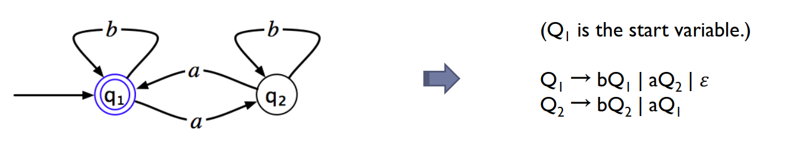
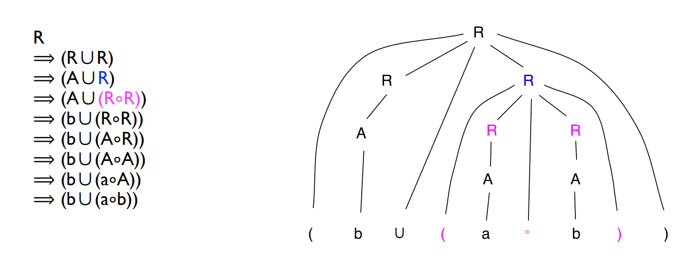
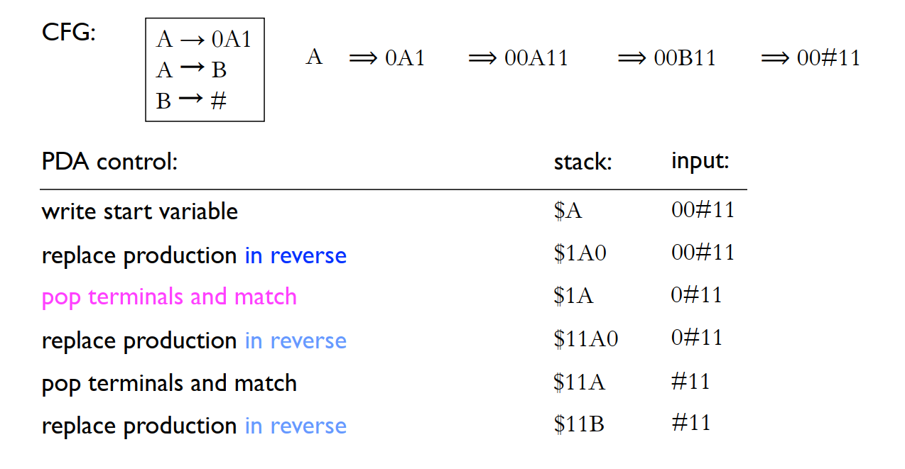
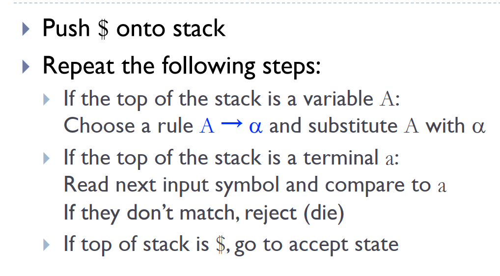
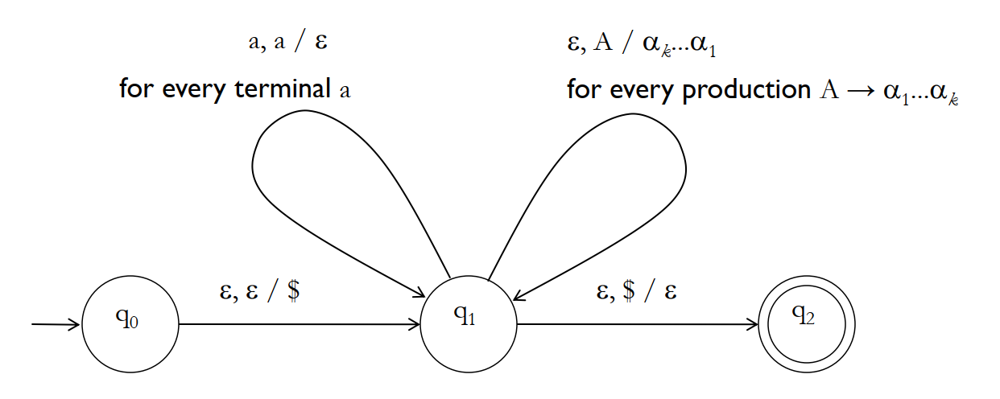
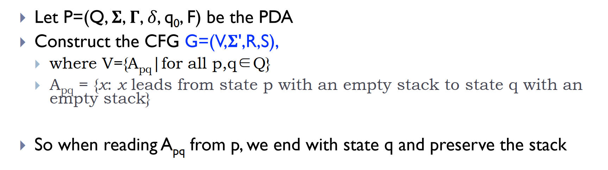
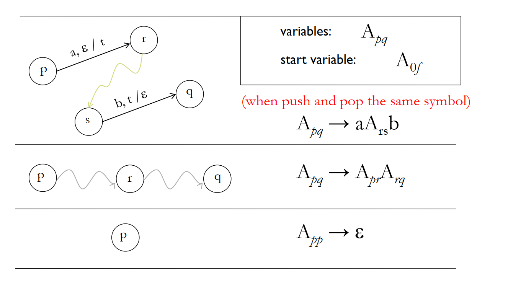
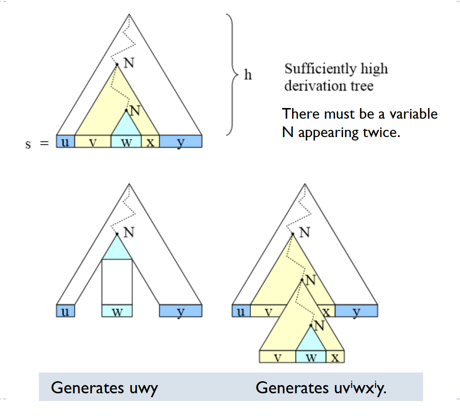

# Lecture 4 Context-Free Grammar

## Context-Free Grammar

We have already known that REGEXPs can *generate* languages. Now we introduce another way to generate languages: *Context-free grammar (CFG)*.

> **Definition:**
>
> A *CFG* is a 4-tuple $(V, \Sigma, R, S)$:
> - $V$ is a set of *variables*.
> - $\Sigma$ is a set of *terminals*.
> - $R$ is a set of *rules* (a rule consists of a variable and a sting in $(V\cup \Sigma)^*$).
> - $S$ is the *start variable*.
>
> We say $uAv$ *yields* $uwv$ ($uAv \Rightarrow uwv$) if $A\to w$ is a rule in $R$.
>
> We say $u$ *derives* $v$ ($u \Rightarrow^* v$) if $\exists u_1, u_2, \cdots, u_k$ such that $u\Rightarrow u_1\Rightarrow u_2\Rightarrow\cdots\Rightarrow u_k \Rightarrow v$.

总的来说，CFG 就是从 $S$ 开始，每次从现在的字符串中选择一个 variable，依据某个 rule 将其替换为一个 string，直到没有 variable 为止。

> **Definition:**
>
> The *language* of a CFG $G$ is defined as:
>
> $$L(G)=\\{w\in \Sigma^* | S\Rightarrow^* w\\}$$

## CFG is more powerful than DFA

要证明 CFG is **strictly** more powerful than DFA，要从两方面入手：
- (1) 存在 language，可以用 CFG 表达，但不是 regular language。
- (2) 任意 regular language 都可以用 CFG 表达。

对于 (1)，上节课已知 $L=\\{0^n1^n | n\geq 0\\}$ is nonregular，但可以用 CFG $S\to 0S1|\epsilon$ 得到。

对于 (2)，即要证明：

> **Theorem:**
>
> Given a DFA $A=(Q,\Sigma,\delta,q_0,F)$, we can find a CFG $A^{\prime}=(V,\Sigma^{\prime},R,S)$, such that $L(A)=L(A^{\prime})$.
>
> **Proof:**
>
> - 对 $A$ 的每个 state $q_i$，在 $V$ 中引入一个变量 $R_i$。
> - 如果 $\delta(q_i,a)=q_j$，就在 $R$ 中引入 rule $R_i\to a R_j$。
> - $q_0$ 是 starting state，那么 $R_0$ 就是 start variable。
> - 如果 $q_i$ 是一个 accepting state，就在 $R$ 中加入 rule $R_i\to\epsilon$。
>
> 这样构造出来的 $A^{\prime}$ 满足 $L(A)=L(A^{\prime})$。

An example:

## Parse Trees and Ambiguity

可以用一个 parse tree 来表示从 start variable 生成一个 string of terminals 的过程：

> **Definition:**
>
> Parse tree:
> - Each *internal node* labeled with a *variable*.
> - Each *leaf* labeled with a *terminal*.
> - The children of a node represent the rule that was applied.

An example:

> **Definition:**
>
> A CFG is called *ambiguous* if a string has two distinct parse trees.

直观上来说，ambiguous 指的就是存在歧义，比如 $a+a\times a$，如果不定义 + 和 $\times$ 的计算顺序，就有可能先算 +，也可能先算 $\times$。

ambiguous 并不等同于 “存在两种 derivations”，因为两种 derivations 可能对应同一个 parse tree。

> **Definition:**
>
> *Leftmost derivation*: 每一步替换当前 string 最左边的那个 variable。

> **Theorem:**
>
> ambiguous 等价于存在两种 leftmost derivations。

> **Definition:**
>
> A CFL (context free language, 即可以用某个 CFG 生成的 language) is called *inherently ambiguous* if every CFG of it is ambiguous.

An example of inherently ambiguous CFL:

$$L=\\{w | w=a^ib^jc^k, i,j,k\geq 1 \text{ and } i=j \text{ or } i=k\\}$$

## Closure Properties

> **Theorem:**
> 
> CFLs are closed under Union, Concatenation, Kleene Star.
>
> **Proof:**
>
> 只需要在原先的 CFG 之上引入新的 start variable，用新的 start variable 去生成旧的 start variables即可。

> **Theorem:**
> 
> CFLs are NOT closed under intersection. But CFLs are closed under intersection with REGULAR languages.
>
> **Proof:**
>
> $$L = \\{w : w \in \\{0, 1\\}^*, w \text{ is a palindrome, and } w \text{ contains fewer 0s than 1s }\\}$$
>
> 这是两个 CFL 的 intersection，可以用后面将要介绍的 pumping lemma 证明它不是 CFL。

## Pushdown Automaton (PDA)

Regular language 在句法上可以用 REGEXP 生成，在计算模型上可以被 DFA、NFA 识别。CFL 在句法上可以用 CFG 生成，现引入新的计算模型 PDA 来识别 CFL。

由于 CFL 是 regular language 的扩充，PDA 也应该是 NFA 的扩充。事实上，PDA 就是为 NFA 多提供了一个无穷大的 stack，PDA 读取 input 的时候，可以从 stack 中 push 或 pop 一个 symbol。

PDA 做的事情就是，每次读取一个 input（可能是 $\epsilon$），并从 stack 顶部 pop 出一个 symbol（可能是 $\epsilon$），然后 transit to a new state and push a symbol to the top of the stack（可能是 $\epsilon$）。

> **Definition:**
>
> A *pushdown automaton (PDA)* is a 6-tuple $(Q, \Sigma, \Gamma, \delta, q_0, F)$:
> - $Q$ is a finite set of states.
> - $\Sigma$ is the input alphabet.
> - $\Gamma$ is the stack alphabet.
> - $q_0$ in $Q$ is the initial state.
> - $F \subseteq Q$ is a set of final states.
> - $\delta$ is the transition function.
> - - $\delta : Q \times (\Sigma \cup \\{\epsilon\\}) \times (\Gamma \cup \\{\epsilon\\}) \to 2^{Q \times (\Gamma \cup \\{\epsilon\\})}$

> **Definition:**
>
> PDA $(Q, \Sigma, \Gamma, \delta, q_0, F)$ *accepts* string $w \in \Sigma^*$ if:
> - $w$ can be written as $x_1 x_2 \cdots x_m$, each $x_i \in \Sigma \cup \\{\epsilon\\}$.
> - $\exists r_0, r_1, \cdots, r_m \in Q$, a sequence of $m+1$ states.
> - $\exists s_0, s_1, \cdots, s_m \in \Gamma^*$, stack contents.
> - such that
> - - $r_0 = q, s_0=\epsilon$.
> - - $(r_i, b) \in \delta(r_{i-1},x_i, a)$, where $s_{i-1}=ta$ and $s_i=tb$ for $1 \leq i \leq m$.
> - - $r_m\in F$.

可以通过构造 PDA 的方法证明 
$$L=\\{ww^R\\}$$
$$L=\\{w:w=w^R\\}$$
$$L=\\{w: w \text{ has the same number of 0s and 1s}\\}$$
$$L=\\{w: w \text{ has two 0-blocks with same number of 0s}\\}$$
都可以被 PDA 识别。

## Equivalence of CFG and PDA

> **Theorem:**
>
> A language L is context-free if and only if it is accepted by some pushdown automaton.
>
> **Proof:**
>
> (1) From CFG to PDA. 思路就是用 PDA 来模拟 leftmost derivation。将每时每刻的 string 倒序放在 stack中，如果 stack 的顶部是 terminal，就和 input 比较，相同则 pop out，不同则 reject；如果 stack 顶部是 variable，就做 leftmost derivation。
> 
> 例子：
> 
>
> Formally:
> 
>
> 用图来表示 PDA 就是：
> 
>
> (2) From PDA to CFG. 总的思路就是，先令 PDA 只有一个 accept state，并且 accept 之前会清空 stack。然后 CFG 的一个 variable 就是一个字符串的集合，使得 PDA 读取集合中的字符串能从某个 state 转移到另一个 state，同时保持 stack 不变。
>
> Formally:
> 
>
> CFG 的 rules 如下：
> 
>
> 并不给出详细的证明，直观理解即可。

## Chomsky Normal Form and CYK algorithm

> **Definition:**
>
> A context-free grammar is in *Chomsky normal form* if every rule is of the form:
> - $A \to BC$
> - $A \to a$
> 
> 其中，$A, B, C$ 是任意 variables，$a$ 是任意非 $\epsilon$ 的 terminal。$B, C$ 不能是 start variable。允许 $S\to \epsilon$。

任意 CFG 都可以转换成 CNF 的形式，课件的 91-98 页讲得很清楚，还举了个例子。

将任意 CFG 转成 CNF 之后，我们就可以用 *Cocke–Younger–Kasami algorithm* 来判断某个特定的 string 能否被某个特定的 CFG 生成。假设 string 为 $s[1:n]$，CFG 有 $r$ 个 variables $R$，其中 $R_1$ 是 start variable。总的思路是，构造一个 $n\times n\times r$ 的表格 $T$，其中 $T[i,j,k]$ 表示 $s[i:j]$ 能否由 $R_k$ 生成，然后依据 $j-i$ 从小到大的顺序 DP 地判断 $s[i:j]$ 能否被 $R_k$ 生成。最后，$s$ 能被生成当且仅当 $T[1,n,1]$ 为真。

## Pumping Lemma for CFL

> **Theorem:**
>
> If $A$ is a context-free language, then there is a number $p$ (the pumping length)
where, if $s$ is any string in $A$ of length at least $p$, then $s$ may be divides into 5
pieces $s=uvxyz$, satisfying:
> - For each $i\geq 0, uv^ixy^iz \in A$
> - $|vy|> 0$
> - $|vxy|\leq p$
>
> **Proof:**
>
> 用 CFG 来证明，假设 CFG 有 $a$ 个 variables，rules 右手边的 symbols 最长为 $b$ 个。考察 parse tree，当 parse tree 从 root 到 leaf 最深的 path 长度为 $v+2$ 时，至少有一个 variable $N$ 出现了两次，假设 $S\Rightarrow^* uNz\Rightarrow uvNyz\Rightarrow uvxyz$，那么显然也可以有 $S\Rightarrow^* uNz\Rightarrow uvNyz\Rightarrow uvvNyyz\Rightarrow uvvxyyz$。可以算出 $p$ 是 $b,v$ 的一个函数。
> 

可以用 pumping lemma 证明，$\\{a^n b^n c^n | n\geq 0\\}, \\{ww|w\in\\{0,1\\}^*\\}, \\{a^i b^j c^k | 0\leq i\leq j\leq k\\}$ 都不是 context-free 的。