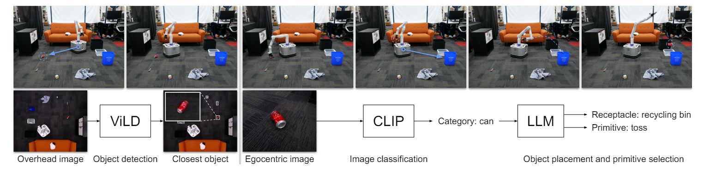
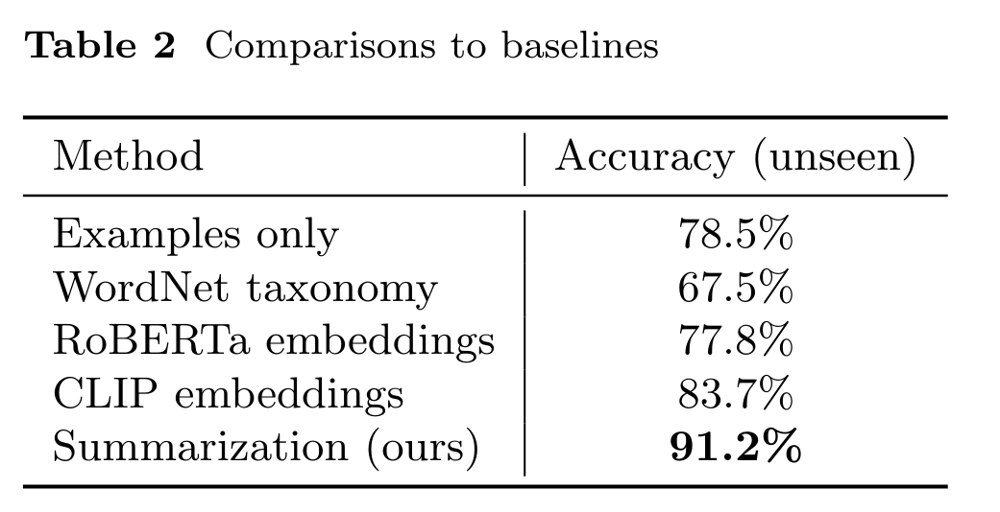
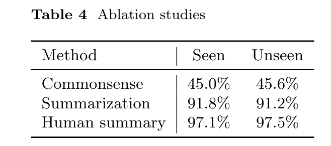
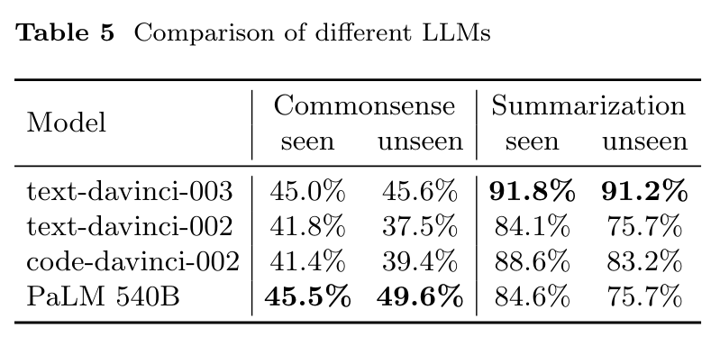
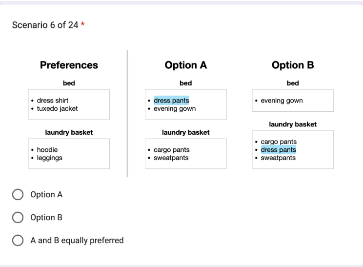
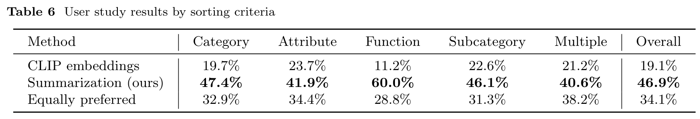
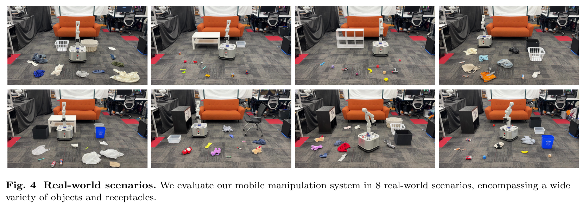
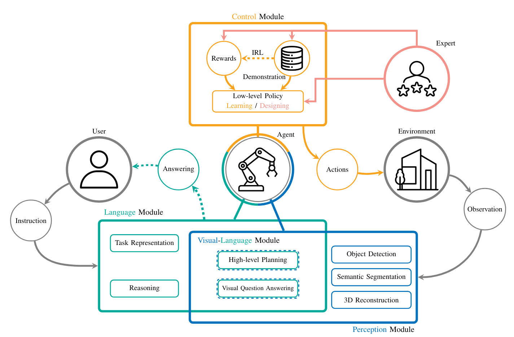
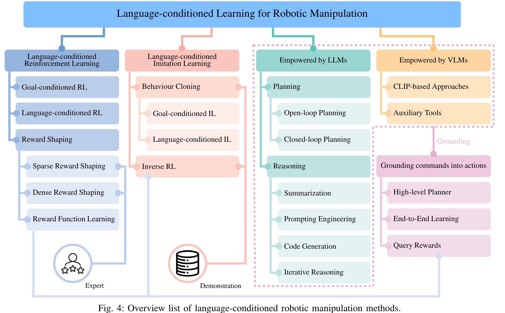

本 blog 主要以 TidyBot 这篇工作为例子，简要介绍一下 Language-Conditioned Mobile Manipulation 这个研究领域。本文采取一个从下而上的方式，先从具体的 TidyBot 出发，再去介绍更广的领域。

## TidyBot

简单来说，TidyBot 是一个能 *个性化、自动化* 地帮助人们整理家中杂乱物品的机器人。
- 论文地址：[https://arxiv.org/abs/2305.05658](https://arxiv.org/abs/2305.05658)
- 项目官网：[https://tidybot.cs.princeton.edu/](https://tidybot.cs.princeton.edu/)
- 开源代码：[https://github.com/jimmyyhwu/tidybot](https://github.com/jimmyyhwu/tidybot)



### TL;DR

这篇工作的主要目的就是设计一个能够 *个性化、自动化* 地帮助人们整理家中杂物的机器人。它需要能够识别地上的物体，判断该物体需要被 *如何* 收纳到 *何处*（如扔到垃圾桶里、放到抽屉里、放到沙发上等）。注意两点要求：

- 个性化：由于不同的人可能有不同的收纳习惯，可能有些人喜欢把衣服放在架子上，有些人则可能喜欢放在抽屉里。
  
  这意味着机器人不能给出一个广泛的策略（对于所有人来说，都把衣服放到架子上），它必须学习到其主人的喜好，从而指定专门的策略。
- 自动化：一旦设定完成，机器人收纳杂物的过程必须是全自动化的，不能让它的主人在旁边告诉它某物应该收纳到某处。

运用 LLM 的总结推理能力可以很好地解决这两个问题。这篇文章的 methods 非常直接，分为两步：

- 在机器人第一次开始工作之前，先让主人提供几个例子，比如“黄衬衫要被放在抽屉里、深紫色衬衫要被放在柜子里、白色袜子要被放在抽屉里、黑色衬衫要被放在柜子里”。将这些例子告诉 LLM，让其总结出规则，LLM 就会总结出：“浅色的东西需要放在抽屉里，深色的东西需要放在柜子里。”
- 机器人工作过程中，先识别地上的某个物体，将第一步中得到的规则和这个物体是什么告诉 LLM，LLM 就可以告诉机器人这个物体需要被放在什么地方。

对于每个物体该 *如何* 被放置也是同理，先给 LLM 提供一些例子，如 "pick and place yellow shirt, pick and place dark purple shirt, pick and toss white socks"。LLM 可以总结出 "pick and place shirts, pick and toss socks"，再将 LLM 的 summarization 用于新物体即可。

再加上一些物体识别，以及让机器人执行对应的收纳动作，这个个性化、自动化的收纳系统就可以被运用于真实世界中。

### Method

[# TL;DR](#tldr) 中已经简略介绍了本工作的 methods，接下来 formally 展示下这样一个收纳系统的 pipeline：

- $E_{receptacle}$ 和 $E_{primitive}$ 都是用户的个性化输入，分别代表了每个物品 $o_i$ 需要被收纳到何处 $r_i$，以及需要被如何收纳 $p_i$。
- 接着运用 LLM 将 $E_{receptacle}$ 和 $E_{primitive}$ 总结成 $S_{receptacle}$ 和 $S_{primitive}$。
- 此时需要将 $S_{receptacle}$ 中 LLM 总结出的物体类别 （如浅色衣服、深色衣服）提取出来，以便于视觉系统进行分类。此处 pipeline 中只写了 $S_{receptacle}$，而没写 $S_{primitive}$，或许是默认了二者提取出来的物体类别是一致的，但严谨来说，同时考虑 $S_{receptacle}$ 和 $S_{primitive}$ 应该更合理。将物体类别 $C$ 提取出来的好处在于，后面进行物体分类的时候就可以只考虑较少的类别，不容易分类错误，而且不同的用户的 $C$ 也可以不同，更加 flexible。
- 做好了前置工作，就可以将系统部署到真实的机器人上了，系统会进入以下收纳循环，每一循环收纳一个物品，直到没有物品可以收纳：
- - 利用外置摄像头得到地板的俯视图，通过 ViLD 识别出距离机器人最近的物体。
- - 机器人移动到此物体旁，通过其自身的摄像头得到物体的近距离照片，将近距离照片与 $C$ 告诉 CLIP，让其对物体进行分类，得到类别 $c$。
- - 让 LLM 根据 $c, S_{receptacle}, S_{primitive}$ 总结出物体该 *如何* 被放置到 *何处*。
- - 机器人执行相应的收纳动作。

涉及到 LLM 的部分，具体 prompt 可以参阅原论文 Appendix A。

### Experiments

#### Benchmark Dataset

为了评估所提出方法的可靠性，作者专门做了一个 benchmark dataset，其中共包含 96 个个性化场景，每个场景里都有一些容器和一些物品，其中有些物品被标注了应该被放到什么容器里，而另一些物品并没被标注。注意，每个场景可能代表了不同的收纳喜好，所以对于同一个物品，不同场景的收纳容器可能大不相同。任务的目的就是根据被标注的物品来预测未被标注的物体应该被放到哪里。

在这个数据集上，作者做了一些实验：[# Baseline Comparisons](#baseline-comparisons), [# Ablation Studies](#ablation-studies), [# Human Evaluation](#human-evaluation)。

#### Baseline Comparisons

这部分，作者将自己的方法与一些 baseline 作比较，比如只给 LLM 提供标注物体，直接让其预测为被标注物体该被放到哪里，而不经过 summarization 过程；再比如利用 pre-trained text embedding，对于未标注的物体，直接找到与其 embedding 距离最近的标注物体，认为二者应该被收纳到同一个地方。结论就是，作者的方法胜过其他 baseline。

#### Ablation Studies

作者一共做了三个方面的 ablation studies：
- 1. 不利用 user specific preference，直接让 LLM 依据 commonsense 来推断物品应该被放到哪里。
- 2. 让人类来进行 summarization，不用 LLM 做。
- 3. 比较采用不同 LLM 的准确率。

 

结论是，让 LLM 进行 summarization 会比直接用 commonsense 有非常大的提升，但相较于直接让人类进行 summarization 仍有不足。这也说明通过提升 LLM 的总结能力还能进一步提升此系统的能力。

另一方面，在不同的 LLM 中，text-davinci-003 有较好的效果。

#### Human Evaluation

作者还招募了一些志愿者，向他们提供 user preference、baseline 给出的收纳建议、自己方法给出的收纳建议，让他们比较自己的方法与 baseline 的结果，哪个更符合 user preference。题目形式如下图所示：

结果显示，作者的方法有 46.9% 的情况被认为更好，而 baseline 只有 19.1% 的情况被认为更好。

#### Real-world Experiments

正如 [# Method](#method) 中说的，作者还搭建了一个真实的机器人平台，让文章中提出的个性化收纳方法能够落地。作者构造了 8 个真实场景，每个场景包含一些散落在地上的物品以及几个收纳容器，然后让系统根据 [# Method](#method) 中的 pipeline 运行。结果显示，系统在 85.0% 情况下都能正确完成收纳任务。

## Language-Conditioned Mobile Manipulation

TidyBot 属于一个更广的研究领域 Language-Conditioned Mobile Manipulation。这个领域将 CV、NLP、Robotics 结合了起来，要求机器人能够根据人类的自然语言指令去做出相应的行为。

这篇文章为 Language-Conditioned Mobile Manipulation 领域做了个详细的调查：
- 论文地址：[https://arxiv.org/pdf/2312.10807](https://arxiv.org/pdf/2312.10807)
- 开源代码：[https://github.com/hk-zh/language-conditioned-robot-manipulation-models](https://github.com/hk-zh/language-conditioned-robot-manipulation-models)

### Architecture Framework

此领域工作的总体框架如上图所示。主要包括三个模块
- 语言模块。其主要作用是理解用户的语言输入，并转化为机器人动作指导。如 TidyBot 中，用户告诉系统收纳 preference，语言模块就会进行处理，进行 preference 的总结等。
- 感知模块。其主要作用是感知周围环境，例如 TidyBot 中机器人利用自身的相机去识别物体进行分类。
- 控制模块。其主要作用是让机器人执行需要执行的指令。对应到 TidyBot 中，就是机器人去执行 “移动到某处”、“拿起地上的物品”、“把物品放置到某处” 等。在 TidyBot 中，这样的动作是 hard-coded 的，当然也可以采用 reinforcement learning (RL), imitation learing (IL) 等方法得到。

### Approaches Categorization

Language-Conditioned Mobile Manipulation 的工作主要可以被粗略分为以下几类：

- Language-conditioned Reinforcement Learning
- Language-conditioned Imitation Learning
- Empowered by LLMs & VLMs

当然，有些工作可能可以被同时划分到多种类别中。其中，前两种方法较为传统，没有采用大语言模型等现成工具。第三种方法利用现成的 LLMs 与 VLMs，简化了系统，提高了能力。

#### Language-conditioned Reinforcement Learning

此类工作利用强化学习，通过人为设计等方法，建立一个从自然语言到 reward 的一个映射，当 agent 达到自然语言描述的目标时，它就能得到对应的 reward。Agent 在这个过程中可以学习到一个从自然语言到具体动作的映射。具体工作有：

- Lancon-learn: Learning with language to enable generalization in multi-task manipulation [[paper]](https://ieeexplore.ieee.org/document/9667188) [[code]](https://github.com/hartikainen/metaworld/tree/reward-tweaks-rebase)
- Pixl2r: Guiding reinforcement learning using natural language by mapping pixels to rewards [[paper]](https://proceedings.mlr.press/v155/goyal21a.html)[[code]](https://github.com/prasoongoyal/PixL2R)
- Learning from symmetry: Meta-reinforcement learning with symmetrical behaviors and language instructions [[paper]](https://arxiv.org/abs/2209.10656)[[website]](https://tumi6robot.wixsite.com/symmetry/) 
- Meta-reinforcement learning via language instructions [[paper]](https://arxiv.org/abs/2209.04924)[[code]](https://github.com/yaoxt3/MILLION)[[website]](https://tumi6robot.wixsite.com/million)
- Learning language-conditioned robot behavior from offline data and crowd-sourced annotation [[paper]](https://proceedings.mlr.press/v164/nair22a/nair22a.pdf) 
- Concept2robot: Learning manipulation concepts from instructions and human demonstrations [[paper]](https://www.roboticsproceedings.org/rss16/p082.pdf) 

#### Language-conditioned Imitation Learning

此类工作利用模仿学习的范式，其不像强化学习那样要求提供 reward，但是需要提供一些正确的行为例子 (expert demonstrations)，agent 会根据这些正确的行为进行学习。具体可以再被细分为 behavior cloning (BC) 和 inverse reinforcement learning (IRL)。

BC 就是直接依样画葫芦，expert demonstrations 里怎么做，agent 就怎么做。具体工作有：

- Language conditioned imitation learning over unstructured data [[paper]](https://arxiv.org/abs/2005.07648) [[code]]() [[website]](https://language-play.github.io/)
- Bc-z: Zero-shot task generalization with robotic imitation learning [[paper]](https://arxiv.org/abs/2202.02005) 
- What matters in language-conditioned robotic imitation learning over unstructured data [[paper]](https://arxiv.org/abs/2204.06252) [[code]](https://github.com/lukashermann/hulc)[[website]](http://hulc.cs.uni-freiburg.de/) 
- Grounding language with visual affordances over unstructured data [[paper]](https://arxiv.org/abs/2210.01911) [[code]](https://github.com/mees/hulc2)[[website]](http://hulc2.cs.uni-freiburg.de/)
- Language-conditioned imitation learning with base skill priors under unstructured data [[paper]](https://arxiv.org/abs/2305.19075) [[code]](https://github.com/hk-zh/spil) [[website]](https://hk-zh.github.io/spil/)
- Pay attention!- robustifying a deep visuomotor policy through task-focused visual attention [[paper]](https://arxiv.org/abs/1809.10093)
- Language-conditioned imitation learning for robot manipulation tasks [[paper]](https://arxiv.org/abs/2010.12083)

IRL 则需要经历两个步骤，第一步先从 expert demonstrations 和语言命令中学习一个从自然语言命令到 reward 的映射，再通过 RL 的方式学习行为策略（这样看来，此部分与 [# Language-conditioned Reinforcement Learning](#language-conditioned-reinforcement-learning) 也有交集）。具体工作：

- Grounding english commands to reward function [[paper]](https://www.roboticsproceedings.org/rss11/p18.pdf)
- From language to goals: Inverse reinforcement learning for vision-based instruction following [[paper]](https://arxiv.org/abs/1902.07742)

#### Empowered by LLMs & VLMs

前两类方法均需要对文本信息进行学习，而有了 LLM 这样强有力的工具，就可以对系统进行简化。具体而言，可以利用好大语言模型的 planning 和 reasoning 能力。

大语言模型的 planning 能力指的是其将复杂任务转化为一系列简单的、机器人能够执行的任务的能力。譬如要求机器人炒菜，直接学习一个炒菜的策略是非常难的，但可以先让 LLM 将炒菜的动作拆分成 洗菜、放油、放菜 等一系列简单的、机器人能够学会的动作，此时再让机器人去执行这些动作就能完成炒菜的任务了。具体工作有：

- Sayplan: Grounding large language models using 3d scene graphs for scalable task planning [[paper]](https://arxiv.org/abs/2307.06135)
- Language models as zero-shot planners: Extracting actionable knowledge for embodied agents [[paper]](https://arxiv.org/abs/2201.07207)
- Describe, explain, plan and select: Interactive planning with large language models enables open-world multi-task agents [[paper]](https://arxiv.org/abs/2302.01560)
- Progprompt: Generating situated robot task plans using large language models [[paper]](https://arxiv.org/abs/2209.11302)
- Robots that ask for help: Uncertainty alignment for large language model planners [[paper]](https://arxiv.org/abs/2307.01928)
- Task and motion planning with large language models for object rearrangement [[paper]](https://arxiv.org/abs/2303.06247)
- Do as i can, not as i say: Grounding language in robotic affordances [[paper]](https://arxiv.org/abs/2204.01691)
- The 2014 international planning competition: Progress and trends [[paper]](https://ojs.aaai.org/aimagazine/index.php/aimagazine/article/view/2571)
- Robot task planning via deep reinforcement learning: a tabletop object sorting application [[paper]](https://ieeexplore.ieee.org/document/8914278)
- Robot task planning and situation handling in open worlds [[paper]](https://arxiv.org/abs/2210.01287) [[code]](https://github.com/yding25/GPT-Planner) [[website]](https://cowplanning.github.io/)
- Embodied Task Planning with Large Language Models [[paper]](https://arxiv.org/abs/2307.01848) [[code]](https://github.com/Gary3410/TaPA) [[website]](https://gary3410.github.io/TaPA/)
- Text2motion: From natural language instructions to feasible plans [[paper]](https://arxiv.org/abs/2303.12153) [[website]](https://sites.google.com/stanford.edu/text2motion)
- Large language models as commonsense knowledge for large-scale task planning [[paper]](https://arxiv.org/abs/2305.14078) [[code]](https://github.com/1989Ryan/llm-mcts) [[website]](https://llm-mcts.github.io/)
- Alphablock: Embodied finetuning for vision-language reasoning in robot manipulation [[paper]](https://arxiv.org/abs/2305.18898) 
- Learning to reason over scene graphs: a case study of finetuning gpt-2 into a robot language model for grounded task planning [[paper]](https://www.frontiersin.org/articles/10.3389/frobt.2023.1221739/full) [[code]](https://github.com/dnandha/RobLM)
- Scaling up and distilling down: Language-guided robot skill acquisition [[paper]](https://arxiv.org/abs/2307.14535)[[code]](https://github.com/real-stanford/scalingup) [[website]](https://www.cs.columbia.edu/~huy/scalingup/)
- Stap: Sequencing task-agnostic policies [[paper]](https://ieeexplore.ieee.org/document/10160220) [[code]](https://github.com/agiachris/STAP)[[website]](https://sites.google.com/stanford.edu/stap/home)
- Inner monologue: Embodied reasoning through planning with language models [[paper]](https://arxiv.org/abs/2207.05608) [[website]](https://innermonologue.github.io/) 

大语言模型的 reasoning 能力就像 TidyBot 中展示的那样，利用 LLM 去推理某个物品应该被放置到何处，再让机器人去执行特定的策略。具体工作有：

- Rearrangement:A challenge for embodied ai [[paper]](https://arxiv.org/abs/2011.01975)
- The threedworld transport challenge: A visually guided task and motion planning benchmark for physically realistic embodied ai [[paper]](https://ieeexplore.ieee.org/document/9812329) 
- Tidy up my room: Multi-agent cooperation for service tasks in smart environments [[paper]](https://dl.acm.org/doi/abs/10.3233/AIS-190524) 
- A quantifiable stratification strategy for tidy-up in service robotics [[paper]](https://ieeexplore.ieee.org/document/9542842)
- Tidybot: Personalized robot assistance with large language models [[paper]](https://arxiv.org/abs/2305.05658)
- Housekeep: Tidying virtual households using commonsense reasoning [[paper]](https://arxiv.org/abs/2205.10712)
- Building cooperative embodied agents modularly with large language models [[paper]](https://arxiv.org/abs/2307.02485)
- Socratic models: Composing zero-shot multimodal reasoning with language [[paper]](https://arxiv.org/abs/2204.00598)
- Voyager: An open-ended embodied agent with large language models [[paper]](https://arxiv.org/abs/2305.16291)
- Translating natural language to planning goals with large-language models [[paper]](https://arxiv.org/abs/2302.05128)

在自然语言的基础上，可以再加上视觉工具，比如 TidyBot 中识别物体的部分。利用了 VLMs 的具体工作有：

- Cliport: What and where pathways for robotic manipulation [[paper]](https://arxiv.org/abs/2109.12098) [[code]](https://github.com/cliport/cliport) [[website]](https://cliport.github.io/)
- Transporter networks: Rearranging the visual world for robotic manipulation [[paper]](https://proceedings.mlr.press/v155/zeng21a/zeng21a.pdf) [[code]](https://github.com/google-research/ravens) [[website]](https://transporternets.github.io/)
- Simple but effective: Clip embeddings for embodied ai [[paper]](https://openaccess.thecvf.com/content/CVPR2022/papers/Khandelwal_Simple_but_Effective_CLIP_Embeddings_for_Embodied_AI_CVPR_2022_paper.pdf) 
- Instruct2act: Mapping multi-modality instructions to robotic actions with large language model [[paper]](https://arxiv.org/abs/2305.11176) [[code]](https://github.com/OpenGVLab/Instruct2Act)
- Latte: Language trajectory transformer [[paper]](https://arxiv.org/abs/2208.02918) [[code]](https://github.com/arthurfenderbucker/LaTTe-Language-Trajectory-TransformEr)
- Embodied Task Planning with Large Language Models [[paper]](https://arxiv.org/abs/2307.01848) [[code]](https://github.com/Gary3410/TaPA) [[website]](https://gary3410.github.io/TaPA/)
- Palm-e: An embodied multimodal language model [[paper]](https://arxiv.org/abs/2303.03378)  [[website]](https://palm-e.github.io/)
- Socratic models: Composing zero-shot multimodal reasoning with language [[paper]](https://arxiv.org/abs/2204.00598)
- Pretrained language models as visual planners for human assistance [[paper]](https://openaccess.thecvf.com/content/ICCV2023/papers/Patel_Pretrained_Language_Models_as_Visual_Planners_for_Human_Assistance_ICCV_2023_paper.pdf) [[code]](https://github.com/facebookresearch/vlamp)
- Open-world object manipulation using pre-trained vision-language models [[paper]](https://arxiv.org/abs/2303.00905) [[website]](https://robot-moo.github.io/)
- Robotic skill acquisition via instruction augmentation with vision-language models [[paper]](https://arxiv.org/abs/2211.11736) [[website]](https://instructionaugmentation.github.io/)
- Language reward modulation for pretraining reinforcement learning [[paper]](https://arxiv.org/abs/2308.12270) [[code]](https://github.com/ademiadeniji/lamp)
- Vision-language models as success detectors [[paper]](https://proceedings.mlr.press/v232/du23b.html)