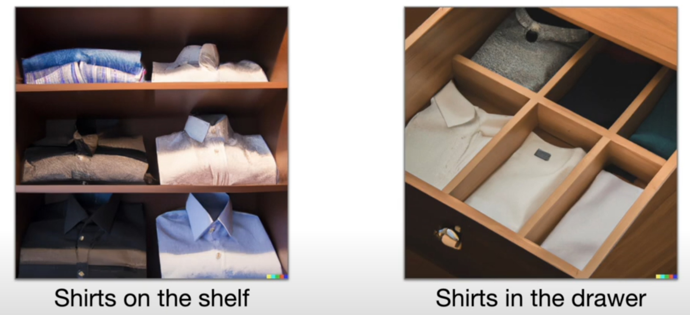

这篇 blog 主要介绍一下 TidyBot 这篇工作。总而言之，TidyBot 是一个能 *个性化、自动化* 地帮助人们整理家中杂乱物品的机器人。
- 论文地址：[https://arxiv.org/abs/2305.05658](https://arxiv.org/abs/2305.05658)
- 项目官网：[https://tidybot.cs.princeton.edu/](https://tidybot.cs.princeton.edu/)
- 开源代码：[https://github.com/jimmyyhwu/tidybot](https://github.com/jimmyyhwu/tidybot)



## TL;DR

这篇工作的主要目的就是设计一个能够 *个性化、自动化* 地帮助人们整理家中杂物的机器人。它需要能够识别地上的物体，判断该物体需要被 *如何* 收纳到 *何处*（如扔到垃圾桶里、放到抽屉里、放到沙发上等）。注意两点要求：

- 个性化：由于不同的人可能有不同的收纳习惯，可能有些人喜欢把衣服放在架子上，有些人则可能喜欢放在抽屉里。
  
  这意味着机器人不能给出一个广泛的策略（对于所有人来说，都把衣服放到架子上），它必须学习到其主人的喜好，从而指定专门的策略。
- 自动化：一旦设定完成，机器人收纳杂物的过程必须是全自动化的，不能让它的主人在旁边告诉它某物应该收纳到某处。

运用 LLM 的总结推理能力可以很好地解决这两个问题。这篇文章的 methods 非常直接，分为两步：

- 在机器人第一次开始工作之前，先让主人提供几个例子，比如“黄衬衫要被放在抽屉里、深紫色衬衫要被放在柜子里、白色袜子要被放在抽屉里、黑色衬衫要被放在柜子里”。将这些例子告诉 LLM，让其总结出规则，LLM 就会总结出：“浅色的东西需要放在抽屉里，深色的东西需要放在柜子里。”
- 机器人工作过程中，先识别地上的某个物体，将第一步中得到的规则和这个物体是什么告诉 LLM，LLM 就可以告诉机器人这个物体需要被放在什么地方。

对于每个物体该 *如何* 被放置也是同理，先给 LLM 提供一些例子，如 "pick and place yellow shirt, pick and place dark purple shirt, pick and toss white socks"。LLM 可以总结出 "pick and place shirts, pick and toss socks"，再将 LLM 的 summarization 用于新物体即可。

再加上一些物体识别，以及让机器人执行对应的收纳动作，这个个性化、自动化的收纳系统就可以被运用于真实世界中。

## Method

[# TL;DR](#tldr) 中已经简略介绍了本工作的 methods，接下来 formally 展示下这样一个收纳系统的 pipeline：

- $E_{receptacle}$ 和 $E_{primitive}$ 都是用户的个性化输入，分别代表了每个物品 $o_i$ 需要被收纳到何处 $r_i$，以及需要被如何收纳 $p_i$。
- 接着运用 LLM 将 $E_{receptacle}$ 和 $E_{primitive}$ 总结成 $S_{receptacle}$ 和 $S_{primitive}$。
- 此时需要将 $S_{receptacle}$ 中 LLM 总结出的物体类别 （如浅色衣服、深色衣服）提取出来，以便于视觉系统进行分类。此处 pipeline 中只写了 $S_{receptacle}$，而没写 $S_{primitive}$，或许是默认了二者提取出来的物体类别是一致的，但严谨来说，同时考虑 $S_{receptacle}$ 和 $S_{primitive}$ 应该更合理。将物体类别 $C$ 提取出来的好处在于，后面进行物体分类的时候就可以只考虑较少的类别，不容易分类错误，而且不同的用户的 $C$ 也可以不同，更加 flexible。
- 做好了前置工作，就可以将系统部署到真实的机器人上了，系统会进入以下收纳循环，每一循环收纳一个物品，直到没有物品可以收纳：
- - 利用外置摄像头得到地板的俯视图，通过 ViLD 识别出距离机器人最近的物体。
- - 机器人移动到此物体旁，通过其自身的摄像头得到物体的近距离照片，将近距离照片与 $C$ 告诉 CLIP，让其对物体进行分类，得到类别 $c$。
- - 让 LLM 根据 $c, S_{receptacle}, S_{primitive}$ 总结出物体该 *如何* 被放置到 *何处*。
- - 机器人执行相应的收纳动作。

涉及到 LLM 的部分，具体 prompt 可以参阅原论文 Appendix A。

## Experiments

### Benchmark Dataset

为了评估所提出方法的可靠性，作者专门做了一个 benchmark dataset，其中共包含 96 个个性化场景，每个场景里都有一些容器和一些物品，其中有些物品被标注了应该被放到什么容器里，而另一些物品并没被标注。注意，每个场景可能代表了不同的收纳喜好，所以对于同一个物品，不同场景的收纳容器可能大不相同。任务的目的就是根据被标注的物品来预测未被标注的物体应该被放到哪里。

在这个数据集上，作者做了一些实验：

#### Baseline Comparisons

这部分，作者将自己的方法与一些 baseline 作比较，比如只给 LLM 提供标注物体，直接让其预测为被标注物体该被放到哪里，而不经过 summarization 过程；再比如利用 pre-trained text embedding，对于未标注的物体，直接找到与其 embedding 距离最近的标注物体，认为二者应该被收纳到同一个地方。结论就是，作者的方法胜过其他 baseline。

#### Ablation studies

作者一共做了三个方面的 ablation studies：
- 1. 不利用 user specific preference，直接让 LLM 依据 commonsense 来推断物品应该被放到哪里。
- 2. 让人类来进行 summarization，不用 LLM 做。
- 3. 比较采用不同 LLM 的准确率。

 

结论是，让 LLM 进行 summarization 会比直接用 commonsense 有非常大的提升，但相较于直接让人类进行 summarization 仍有不足。这也说明通过提升 LLM 的总结能力还能进一步提升此系统的能力。

另一方面，在不同的 LLM 中，text-davinci-003 有较好的效果。

#### Human Evaluation

作者还招募了一些志愿者，向他们提供 user preference、baseline 给出的收纳建议、自己方法给出的收纳建议，让他们比较自己的方法与 baseline 的结果，哪个更符合 user preference。题目形式如下图所示：

结果显示，作者的方法有 46.9% 的情况被认为更好，而 baseline 只有 19.1% 的情况被认为更好。

### Real-world Experiments

正如 [# Method](#method) 中说的，作者还搭建了一个真实的机器人平台，让文章中提出的个性化收纳方法能够落地。作者构造了 8 个真实场景，每个场景包含一些散落在地上的物品以及几个收纳容器，然后让系统根据 [# Method](#method) 中的 pipeline 运行。结果显示，系统在 85.0% 情况下都能正确完成收纳任务。

