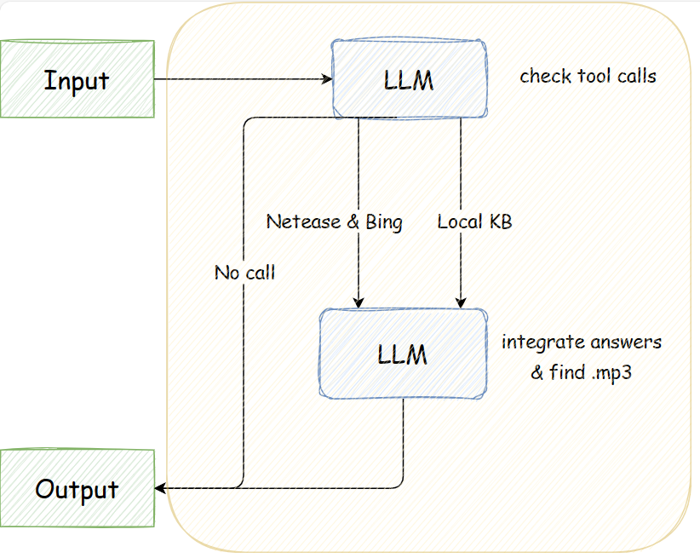
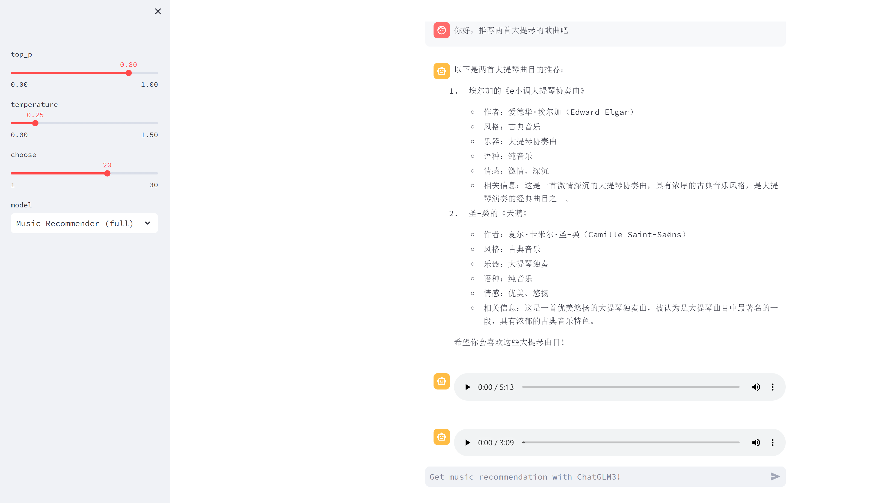
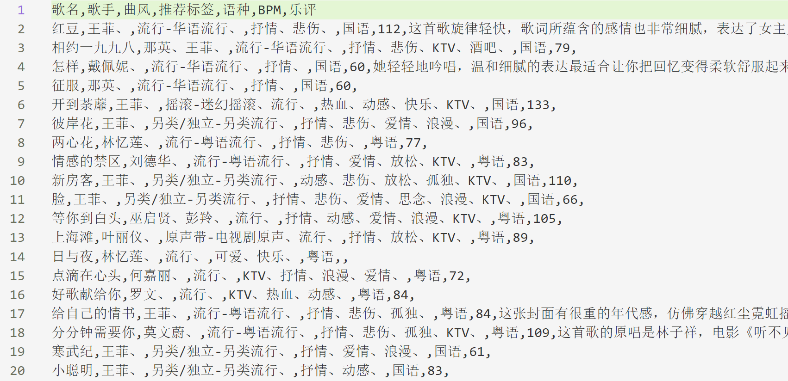
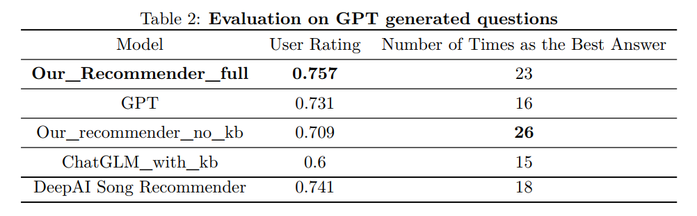
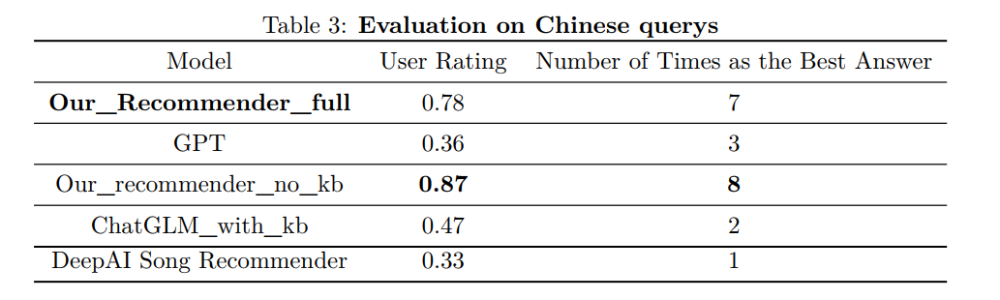
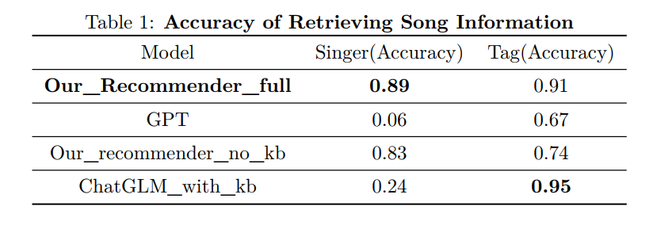

# 2023秋 NLP 课程项目 —— 歌曲问答及推荐系统

## 介绍

受到训练数据的限制，现在的 LLM（如ChatGPT）并没有能力很好地执行对歌曲信息的问答以及歌曲推荐任务，尤其是对于较新的歌曲和中文歌曲。比如“鸡你太美是什么歌曲？”“半岛铁盒是谁的歌？”“给我推荐一首吉他演奏的轻音乐。”

我们希望通过利用搜索引擎、构建本地知识库等方式来解决这个问题。

项目目前开源在 [https://github.com/hs-black/Music-Recommander](https://github.com/hs-black/Music-Recommander) （不要在意拼写错误的细节）。

## 技术实现

### 工具

我们在网上找到了这些工具：
- **[Bing API:](https://learn.microsoft.com/en-us/bing/search-apis/bing-web-search/quickstarts/rest/python)** Bing API 支持用 python 脚本调用 Bing 的搜索功能，可以利用这一 API 搜索歌曲的信息。
- **[NeteaseCloudMusicApi:](https://github.com/Binaryify/NeteaseCloudMusicApi)** 这是一个开源的库，可以调用网易云音乐的很多功能，如获取歌曲的百科信息（曲风、推荐标签、语言、BPM 等）。
- **[Langchain-Chatchat:](https://github.com/chatchat-space/Langchain-Chatchat)** 这个库利用 ChatGLM 等大语言模型与 Langchain 实现了很多功能，如本地知识库问答、搜索引擎问答等。我们主要利用其对本地知识库的检索功能，此部分利用 Embedding Model 进行本地文件的向量化与搜索匹配。
- **[OpenAI API:](https://platform.openai.com/)** 利用 OpenAI 的 API 接口在 Python 中调用 ChatGPT 等大语言模型。

### Pipeline

 

整个项目的 pipeline 如上图所示。对于用户的输入，先用 LLM 检查是否需要调用网易云搜索、Bing 搜索、本地知识库搜索工具。因为其实用户的有些输入与歌曲问答或推荐并没有关系，可以直接用 LLM 进行回答。

若 LLM 认为需要调用工具，它会从用户的输入中提取出调用工具所需要的参数，如歌名、歌手、曲风、语言等信息，并调用网易云搜索、Bing 搜索、本地知识库搜索工具。LLM 会再将三个工具返回的信息进行整合提取，根据用户的输入返回其需要的信息。

我们也实现了 mp3 的搜索功能，对于 LLM 在最后一步中返回的歌曲，利用网易云接口找到其 mp3 音频，并可直接在项目前端播放。

### 前端

项目前端采用 [streamlit](https://streamlit.io/) 实现，用户可以在前端直接与我们的项目进行交流，直接听到项目返回的歌曲。

 

### 本地知识库

我们利用网易云的接口获取了大约500k首歌曲的信息，包括歌名、歌手、曲风、推荐标签、语种、BPM、乐评，整合进[几个 csv 文件](https://github.com/hs-black/Music-Recommander/tree/main/composite_demo/Langchain_Chatchat/knowledge_base/music_new/content)中。

 

接着利用 Langchain-Chatchat 的实现，用 [bge-large-zh](https://huggingface.co/BAAI/bge-large-zh) Embedding Model 对 csv 文件进行向量化，存储在本地向量库里。对于用户的一个 query，将 query 同样向量化以后在本地向量库中寻找相似信息进行整合返回。具体实现可以参考 [Langchain-Chatchat](https://github.com/chatchat-space/Langchain-Chatchat) 的文档。

## Evaluation

本项目其实可以被视为两部分：歌曲推荐系统以及歌曲问答系统，因此 evaluation 也从这两部分分别下手。

### 歌曲推荐系统的 evaluation

我们用 ChatGPT 生成了60个歌曲推荐问题，每个问题指定了歌曲的歌名、歌手、曲风等信息中的一个或几个。为了展示我们项目在中文歌曲上的优越性，我们还多设置了20个与中文歌曲有关的歌曲推荐问题。对于每个模型对每个问题的回答，为了保证评估的科学性与严谨性，我们将其顺序打乱并隐去了对应模型的名字，然后对其进行0到9分的评分。最后统计出每个模型回答的平均得分与其回答为最佳回答的次数。

 
 

各模型的含义：
- **Our_Recommender_full:** 这是我们的系统的完整版。
- **GPT:** 调用 gpt-3.5-turbo-1106 的 API 对用户的生成直接返回。
- **Our_recommender_no_kb:** kb 即 knowledge base，本地知识库。此模型为我们的系统但是去掉本地知识库，仅调用网易云搜索与 Bing 搜索。测试这个模型是为了探究本地知识库对系统生成效果的影响。
- **ChatGLM_with_kb:** 这部分利用了 ChatGLM 大模型以及本地知识库。其实是 Langchain-Chatchat 的知识库问答的实现，可以作为我们系统的离线版本，其不需要进行联网。
- **DeepAI Song Recommender:** 一个歌曲推荐系统，链接为 [https://deepai.org/chat/songs](https://deepai.org/chat/songs)。

从表中可见，在 GPT 生成的问题中，除去 ChatGLM_with_kb 以外的所有模型的表现相差并不多，我们的模型仅有略微的领先。这可能是因为这些模型大多基于 GPT ，在回答 GPT 生成的问题方面可能具有天然的优势。而且这部分的许多问题都偏向西方的音乐，我们的模型由于采用了网易云音乐以及 Bing 中文搜索，在西方音乐方面并没有很大的优势。

而对于中文歌曲，我们的系统就有明显的优势。

### 歌曲问答系统的 evaluation

我们利用网易云音乐的歌曲榜单构建了一个包含 100 首歌曲的 [test set](https://github.com/hs-black/Music-Recommander/blob/main/composite_demo/data/csv_data/data_test.csv)，对于每首歌曲，给定其歌名，向模型询问其歌手信息，并让模型从几个待选标签中选择一个最可能的标签，计算其正确率。

 

我们的模型在两个任务上都有明显的优势。

在歌手信息方面，GPT表现得非常差，这是因为 test set 包含的歌曲多为较新的中文歌曲，其并没有出现在 GPT 的训练数据中。ChatGLM_with_kb 也表现得较差，这是因为 kb 中包含有一首歌曲的很多翻唱版本，LLM 无法判断哪个版本较为重要，因此很难返回正确的结果。但是比较 Our_Recommender_full 和 Our_recommender_no_kb 可以发现将 kb 整合进 Our_recommender_no_kb 中可以提升系统的表现，这是因为网易云搜索与 Bing 搜索已经返回了一些歌曲，kb 返回的翻唱版本并不能对最后的结果有很大的影响，反而，kb 还能补充一些网易云搜索和 Bing 搜索不好搜索到的歌曲信息。

而在 tags 方面，GPT表现得并不像歌手信息方面那么差，这是因为正确的 tags 本身就占待选 tags 的一部分，就算是 random guess 也能有不差的分数，而且 GPT 还可以通过歌名来对 tags 有一个估计。

## 写在最后

我们本来想尝试一下用我们的数据对 GPT 进行 finetune，但无奈经费不足，便放弃了。

感谢我的队友 zzz 和 yht。